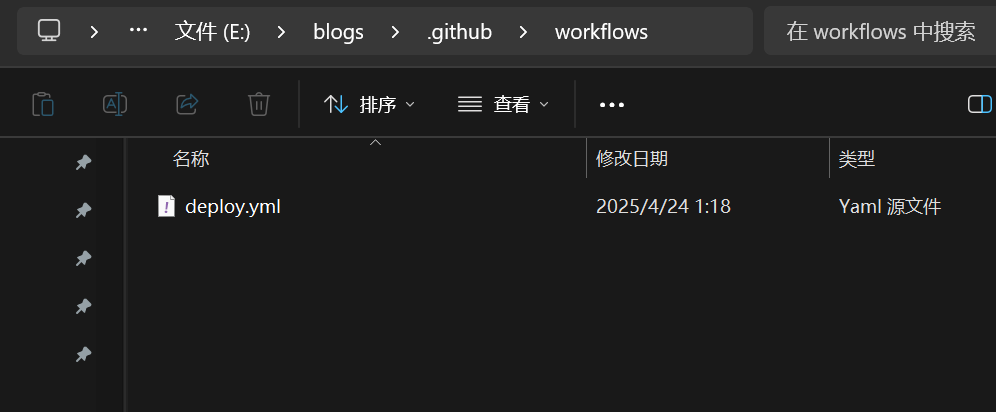
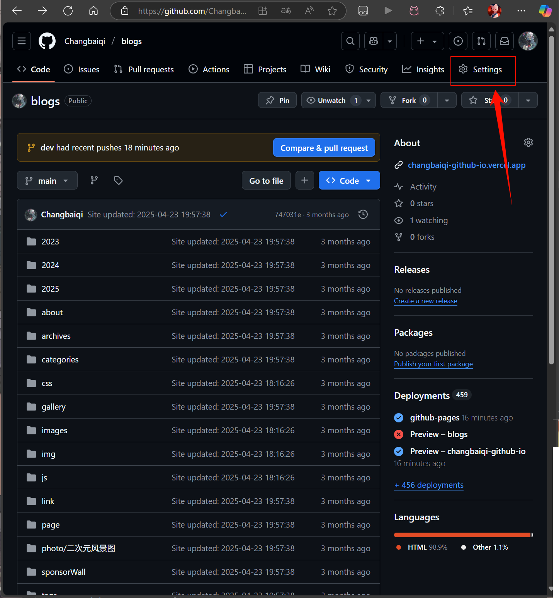
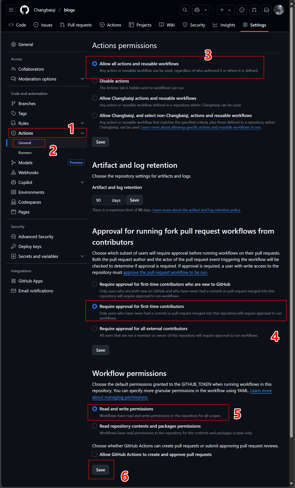
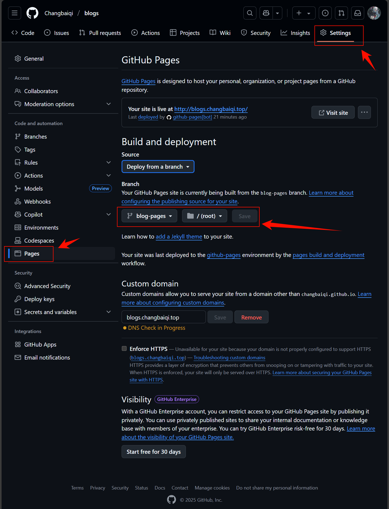

# Hexo+GithubActions+GithubPages自动化部署打包更新博客

---

这篇文章主要是通过Hexo配合Github一系列方便的工具进行一键部署博客更新操作，这样就减少了自行本地静态文件编译和push的操作了，极其方便。


## 1 创建Hexo博客

这里就省略掉博客的搭建工作了，这些都是基础操作，网上可以直接找到文章学着搭建，这里就直接讲述如何利用`GithubActions`将博客自动化部署到`GithubPages`

我用的是`Butterfly主题`


## 2 编写Actions配置文件

首先在博客根目录创建目录`.github\workflows`，然后在此目录下创建对应`Actions`的yaml配置文件，名字随意，我这里取名为`deploy.yml`



然后进入文件编写配置文件：

```yaml
name: Deploy VitePress to GitHub Pages

on:
  push:
    branches:
      - main  # 只在 main 分支有提交时触发部署（可以根据需要修改）

jobs:
  deploy:
    runs-on: ubuntu-latest

    steps:
      # Checkout 仓库
      - name: Checkout repository
        uses: actions/checkout@v3

      # 设置 Node.js 环境
      - name: Set up Node.js
        uses: actions/setup-node@v3
        with:
          node-version: '20.10.0'  # 可以根据需要修改 Node.js 版本

      # 安装依赖
      - name: Install dependencies
        run: |
          npm install
      #安装 Hexo
      - name: Install Hexo-cli 
        run: |
          npm install -g hexo-cli --save
          echo "install hexo successful"
      # 编译创建静态博客文件
      - name: Build Blog 
        run: |
          hexo clean
          hexo g
          echo "build blog successful"

      - name: Deploy Blog
        uses: JamesIves/github-pages-deploy-action@v4
        with:
          branch: blog-pages                 # 部署目标分支
          folder: public      # 构建后的输出目录
```

这样就编写好了。


## 3 开放对应仓库Actions权限

按照下方图片操作开放Actions对应仓库操作权限即可






## 4 提交仓库

这里提交仓库，就是提交你的代码到你对应存储的仓库就行，这就不用说了吧，就是那三大操作

* git add .
* git commit -m "update:更新"
* git push origin main

等待push完毕后Github就会自动打包编译博客生成静态文件到之前设置的`部署目标分支`中


## 5 修改GithubPages规则

这里选择你之前写`GithubActions`配置文件中配置的`部署目标分支`

这里我是`blog-pages`，所以我选择`blog-pages`分支即可

```yaml
      - name: Deploy Blog
        uses: JamesIves/github-pages-deploy-action@v4
        with:
          branch: blog-pages                 # 部署目标分支
          folder: public      # 构建后的输出目录
```


