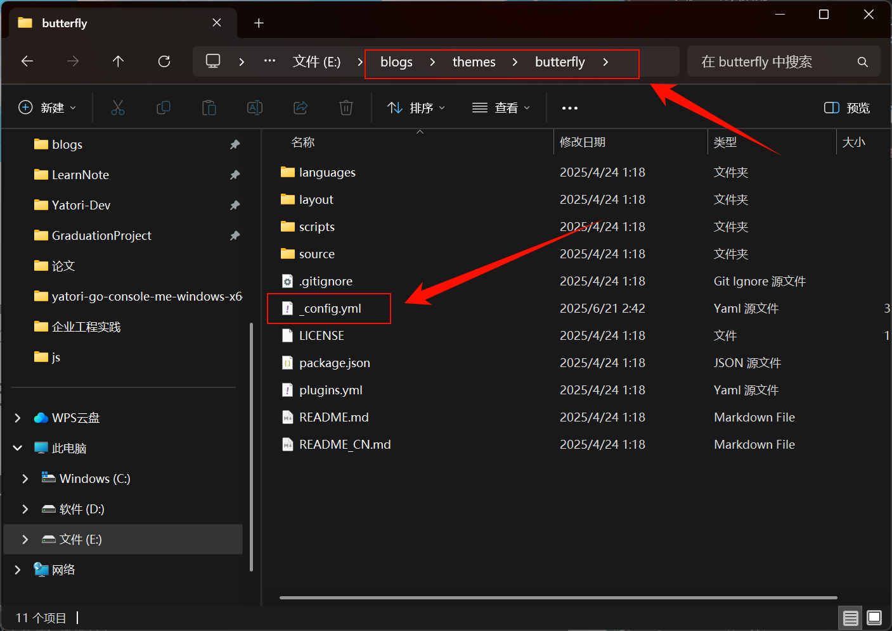
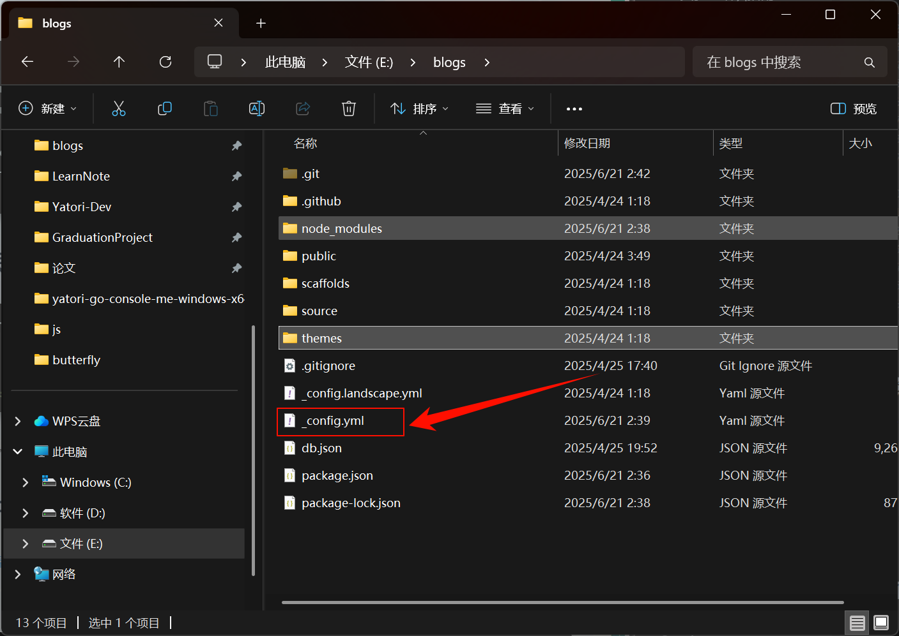

# Hexo启用数学公式渲染

---

这里以Butterfly主题为例，Butterfly主题支持Mathjax和KaTex两种数学公式渲染引擎，这里我使用KaTex插件为例，因为KaTex更快更轻量


## 1 在主题配置文件中配置math

现在主题文件中的_config.yml文件中找到math配置



```yaml

# --------------------------------------
# Math
# --------------------------------------

# About the per_page
# if you set it to true, it will load mathjax/katex script in each page
# if you set it to false, it will load mathjax/katex script according to your setting (add the 'mathjax: true' or 'katex: true' in page's front-matter)
math:
  # Choose: mathjax, katex
  # Leave it empty if you don't need math
  use: katex # 这里填写katex代表选择katex作为公式渲染
  per_page: true
  hide_scrollbar: false

  mathjax:
    # Enable the contextual menu
    enableMenu: true
    # Choose: all / ams / none, This controls whether equations are numbered and how
    tags: none

  katex:
    # Enable the copy KaTeX formula
    copy_tex: true # 启用公式复制
    per_page: false
    hide_scrollbal: true
```


## 2 然后在博客根部木下利用npm指令安装插件

```nginx
npm un hexonpm un hexo-renderer-marked --save # 如果有安装这个的话，卸载
npm un hexo-renderer-kramed --save # 如果有安装这个的话，卸载

npm i hexo-renderer-markdown-it --save # 需要安装这个渲染插件
npm install katex @renbaoshuo/markdown-it-katex #需要安装这个katex插件
```


## 3 在博客根目录中的_config.yml中配置



```yaml
markdown:
  plugins:
    - '@renbaoshuo/markdown-it-katex'
```


## 4 在文章中编写公式

公式格式可以参考洛谷的LateX格式手册[LaTeX 格式手册 | 洛谷帮助中心](https://help.luogu.com.cn/rules/academic/handbook/latex)或者[LaTeX 入门 - OI Wiki](https://oi-wiki.org/tools/latex/)

### 4.1 公式格式

```markdown
$$
S_n = \sum_{i=1}^{n} \frac{1}{i}
$$
```


$$
S_n = \sum_{i=1}^{n} \frac{1}{i}
$$