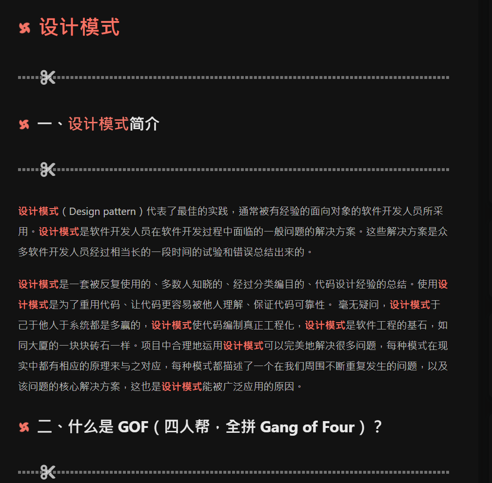

# hexo+buttefly如何添加小风车

---

## 1 效果展示




## 2 如何添加

### 2.1 新建CSS

在对应主题下的`/source/css`下创建对应CSS主题文件，这里我因为用的是buttefly主题，所以路径是`themes/butterfly/source/css`

新建CSS文件之后再在文件里面添加对应代码,这里我创建的文件名称是`pinwheel.css`:

```css
/* 文章页H1-H6图标样式效果 */
h1::before, h2::before, h3::before, h4::before, h5::before, h6::before {
    -webkit-animation: ccc 1.6s linear infinite ;
    animation: ccc 1.6s linear infinite ;
}
@-webkit-keyframes ccc {
    0% {
        -webkit-transform: rotate(0deg);
        transform: rotate(0deg)
    }
    to {
        -webkit-transform: rotate(-1turn);
        transform: rotate(-1turn)
    }
}
@keyframes ccc {
    0% {
        -webkit-transform: rotate(0deg);
        transform: rotate(0deg)
    }
    to {
        -webkit-transform: rotate(-1turn);
        transform: rotate(-1turn)
    }
}
```

