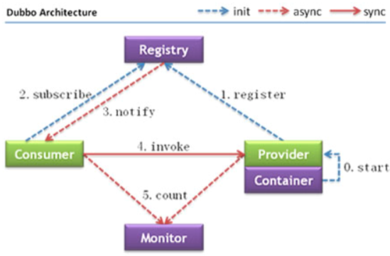

# Dubbo学习

---

## 一、Dubbo是什么

Dubbo是一个分布式服务框架，致力于提供高性能和透明化的RPC远程服务调用方案，以及SOA服务治理方案。简单的说，Dubbo就是各服务框架，如果没有分布式的需求，其实是不需要用的，只有在分布式的时候，才有Dubbo这样的分布式服务框架的需求，并且本质上是各服务调用的东西，说白了就是远程服务调用的分布式框架（告别Web Service模式中的WSdl，以服务者与消费者的方式在Dubbo上注册）

## 二、Dubbo核心组件

1)、注册中心（registry）
生产者在此注册并发布内容，消费者在此订阅并接收发布的内容。

2)、消费者（consumer）
客户端，从注册中心获取到方法，可以调用生产者中的方法。

3)、生产者（provider）
服务端，生产内容，生产前需要依赖容器（先启动容器）。

4)、容器（container）
生产者在启动执行的时候，必须依赖容器才能正常启动（默认依赖的是spring容器），

5)、监控(Monitor)
统计服务的调用次数与时间等。

1)、注册中心（registry）
生产者在此注册并发布内容，消费者在此订阅并接收发布的内容。

2)、消费者（consumer）
客户端，从注册中心获取到方法，可以调用生产者中的方法。

3)、生产者（provider）
服务端，生产内容，生产前需要依赖容器（先启动容器）。

4)、容器（container）
生产者在启动执行的时候，必须依赖容器才能正常启动（默认依赖的是spring容器），

5)、监控(Monitor)
统计服务的调用次数与时间等（推荐使用的程序是dubbo-admin(图形化页面程序)））

## 三、Dubbo核心功能：
Dubbo主要提供了3大核心功能：面向接口的远程方法调用，智能容错和负载均衡，以及服务自动注册和发现。

1）远程方法调用
网络通信框架，提供对多种NIO框架抽象封装，包括“同步转异步”和“请求-响应”模式的信息交换方式。

2）智能容错和负载均衡
提供基于接口方法的透明远程过程调用，包括多协议支持，以及软负载均衡，失败容错，地址路由，动态配置等集群支持。

3）服务注册和发现
服务注册，基于注册中心目录服务，使服务消费方能动态的查找服务提供方，使地址透明，使服务提供方可以平滑增加或减少机器。

四、dubbo高级特性：
1）序列化

* dubbo 内部已经将序列化和反序列化的过程内部封装了

* 我们只需要在定义pojo类时实现Serializable接口即可

* 一般会定义一个公共的pojo模块，让生产者和消费者都依赖该模块。

2）地址缓存
服务提供者向注册中心注册信息，服务消费者向注册中心获取服务提供者的注册信息，同时保存了服务提供者的地址，当下一次请求时就不需要向注册中心获取信息，而是通过缓存的地址向服务提供者直接请求信息。

注册中心挂了，服务是否可以正常访问？

* 可以，因为dubbo服务消费者在第一次调用时，会将服务提供方地址缓存到本地，以后在调用则不会访问注册 中心。

* 当服务提供者地址发生变化时，注册中心会通知服务消费者。

3）超时与重试

* 服务消费者在调用服务提供者的时候发生了阻塞、等待的情形，这个时候，服务消费者会一直等待下去。

* 在某个峰值时刻，大量的请求都在同时请求服务消费者，会造成线程的大量堆积，势必会造成雪崩。

* Dubbo 利用超时机制来解决这个问题，设置一个超时时间，在这个时间段内，无法完成服务访问，则自动断开连接。

* 使用timeout属性配置超时时间，默认值1000，单位毫秒。 设置了超时时间，在这个时间段内，无法完成服务访问，则自动断开连接。

* 如果出现网络抖动，则这一次请求就会失败。Dubbo 提供重试机制来避免类似问题的发生。 通过 retries 属性来设置重试次数。默认为 2 次。