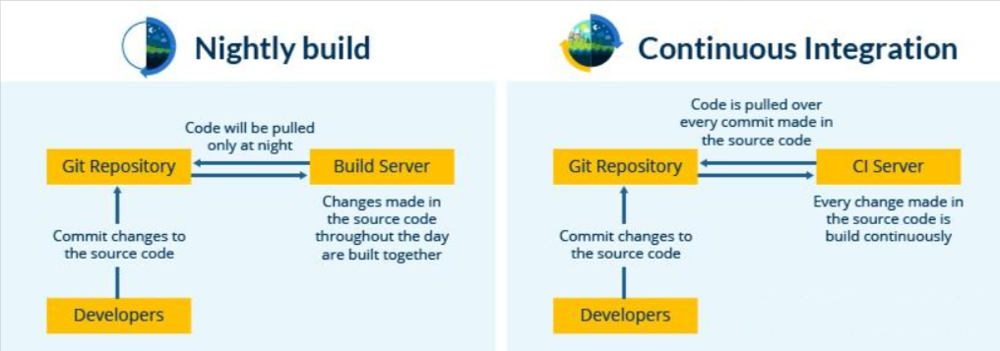
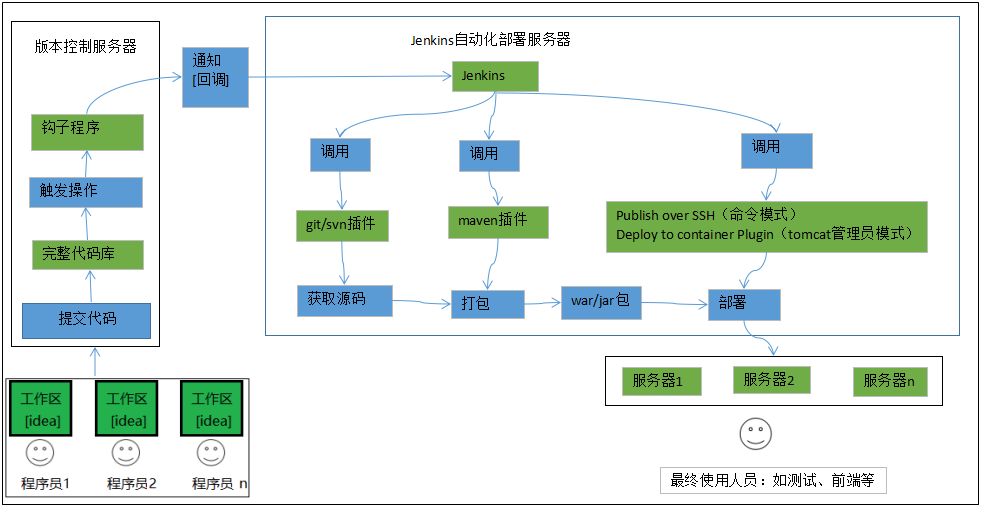
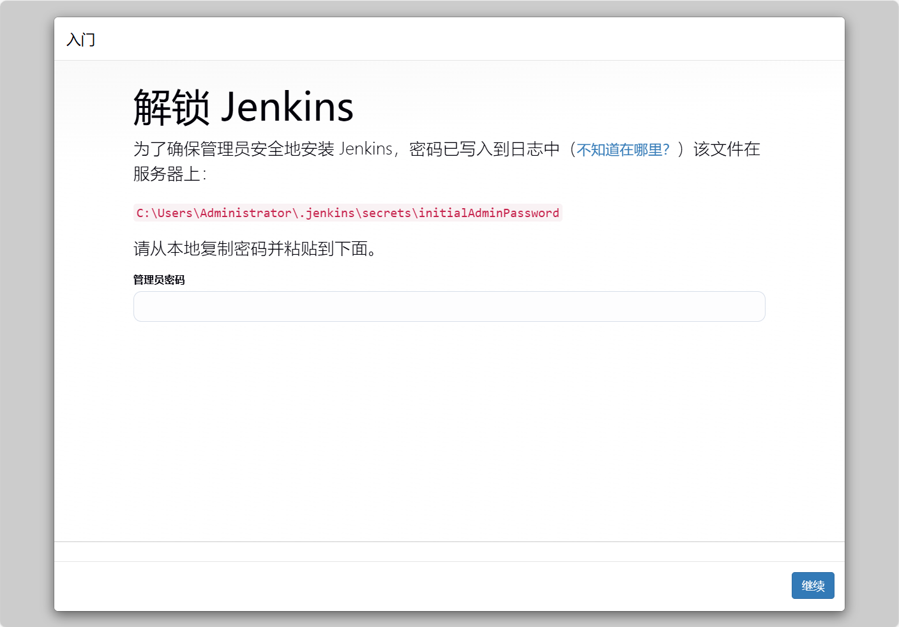
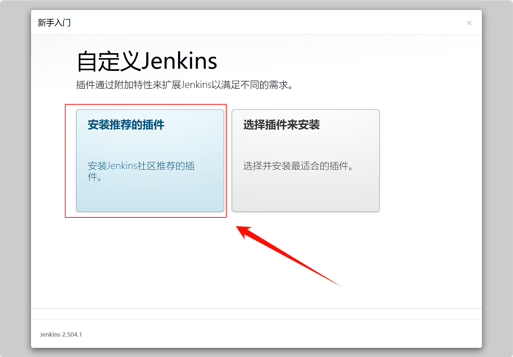
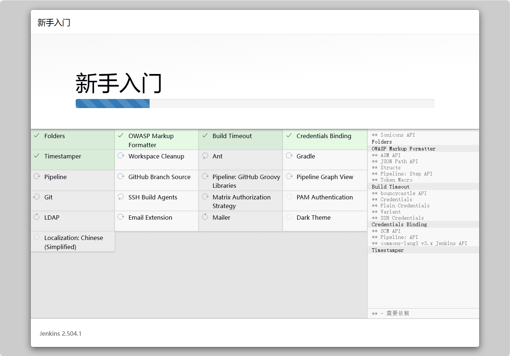
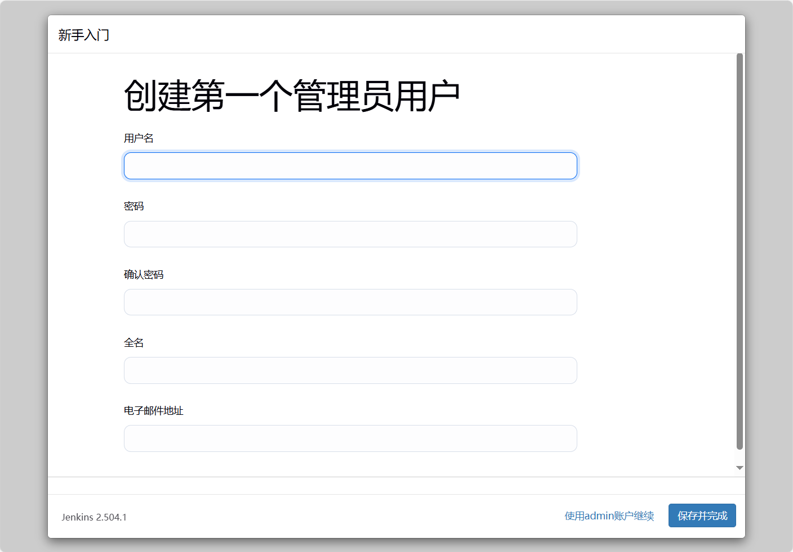
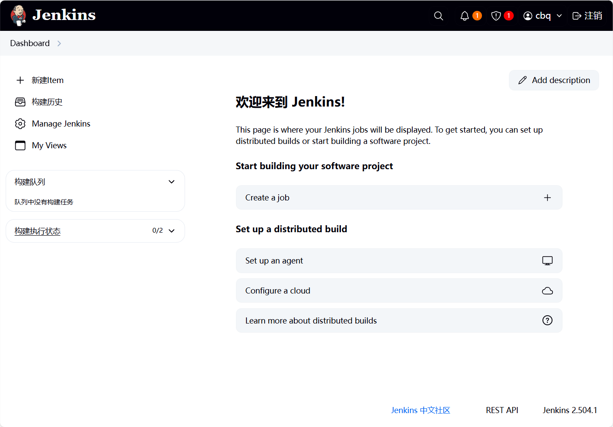
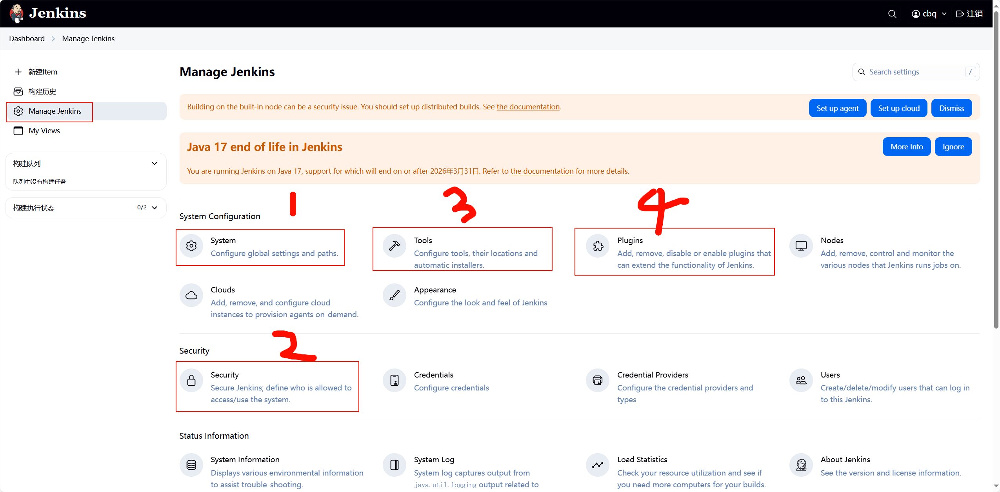

# Jenkins学习

---

## 1  什么是Jenkins

Jenkins 是一个用 Java 编写的开源`自动化工具`，带有用于持续集成的`插件`。Jenkins 用于持续构建和测试您的软件项目，从而使开发人员更容易将更改集成到项目中，并使用户更容易获得新的构建。它还允许您通过与大量测试和部署技术集成来持续交付软件。

借助 Jenkins，组织可以通过自动化来加速软件开发过程。Jenkins 集成了各种开发生命周期过程，包括构建、文档、测试、打包、模拟、部署、静态分析等等。
Jenkins 借助插件实现了持续集成。插件允许集成各种 DevOps 阶段。如果要集成特定工具，则需要安装该工具的插件。例如 Git、Maven 2 项目、Amazon EC2、HTML 发布者等。

Jenkins 的优势包括：

- 是一个具有社区大力支持的开源工具。
- 易于安装。
- 拥有 1000 多个插件，可简化您的工作。如果不存在插件，则可通过编码实现并与社区共享。
- 它是免费的。
- 它是用 Java 构建的，因此可以移植到所有主要平台。

Jenkins 的某些方面将其与其他持续集成工具区分开来。让我们看看这些要点。

## 2  Jenkins 的特性

---

以下是有关Jenkins的一些事实，这些事实使它比其他的持续集成工具更好：

- 应用：Jenkins 应用非常广泛，在全球范围内有超过 147,000 个活跃安装和超过 100 万用户。
- 插件：Jenkins 与1000 多个插件互连，从而使其可以与大多数开发、测试和部署工具集成。

从以上几点可以看出，Jenkins 在全球范围内有很高的需求。在我们深入研究 Jenkins 之前，先了解什么是持续集成以及它的重要性。

## 3  什么是持续集成？

---

持续集成是一种开发实践，在这种实践中，要求开发人员每天多次或更频繁地对共享存储库中的源代码提交更改。然后构建存储库中进行的每个提交。这使团队可以及早发现问题。除此之外，根据持续集成工具的不同，还有其他一些功能，例如在测试服务器上部署构建应用程序，为相关团队提供构建和测试结果等。
让我们通过用例了解它的重要性。

###  3.1 持续集成示例：诺基亚

我敢肯定，您一生中的某些时候都使用过**诺基亚**手机。在诺基亚的一个软件产品开发项目中，有一个名为**每晚构建（Nightly builds）**的过程。每晚构建可以被认为是持续集成的前身。这意味着每天晚上，自动化系统都会拉一整天添加到共享存储库中的代码并构建该代码。这个想法与持续集成非常相似，但是由于在夜间构建的代码很大，因此查找和修复错误确实很麻烦。因此，诺基亚采用了持续集成（CI）。 结果，构建了对存储库中的源代码的所有提交。 如果构建结果表明代码中存在错误，则开发人员仅需要检查该特定提交。 这大大减少了发布新软件所需的时间。

## 4  Jenkins服务器搭建及基本配置

---

以下为Jenkins自动化部署实现原理

###  4.1 Jenkins部署环境

基本环境：

* jdk环境，Jenkins是java语言开发的，因需要jdk环境。

* git/svn客户端，因一般代码是放在git/svn服务器上的，我们需要拉取代码。

* maven客户端，因一般java程序是由maven工程，需要maven打包，当然也有其他打包方式，如：gradle

以上是自动化部署java程序jenkins需要的基本环境，请自己提前安装好，下面着重讲解Jenkins的安装部署配置。

### 4.2 Jenkins安装

1.下载安装包[jenkins.war](http://mirrors.jenkins.io/war-stable/latest/jenkins.war)；

2.在安装包根路径下，运行命令 `java -jar jenkins.war --httpPort=8080，（linux环境、Windows环境都一样）；`

3.打开浏览器进入链接 [`http://localhost:8080`](http://localhost:8080/).

4.填写初始密码，激活系统

5.进入插件安装选择

这里建议选择，推荐安装的插件，保证基本常用的功能可以使用。

选择后，进入插件安装页面

6.设置初始用户和密码

7.进入系统，安装完成

**`注`**:如果还是进入不了系统，需要稍等一下，或者刷新页面，如果还是进入不了，需要重新启动jenkinds服务器。

### 4.3 Jenkins基本配置

#### 4.3.1 系统初始化配置

##### 4.3.1.1 System

在系统设置这里，我们只需要设置最后面的一项，配置远程服务器地址，

即我们代码最终运行的服务器地址信息，就像我们之前手动部署时使用xshell登录Linux服务器一样，

当然这里是可以配置多台远程Linux服务器的，配置完成后点击保存即可，为后面我们配置自动化部署做准备，配置如下图

##### 4.3.1.2 Security

##### 4.3.1.3 Tools

##### 4.3.1.2 Plugins

