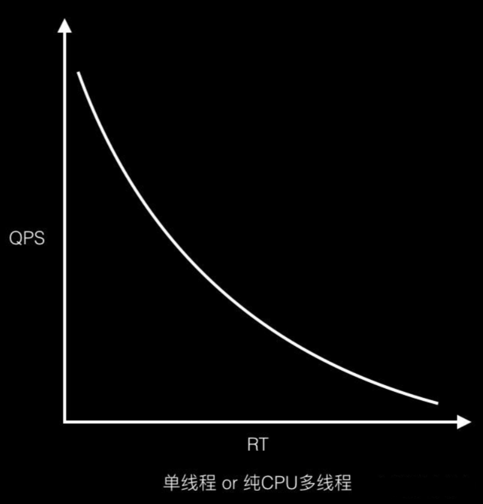
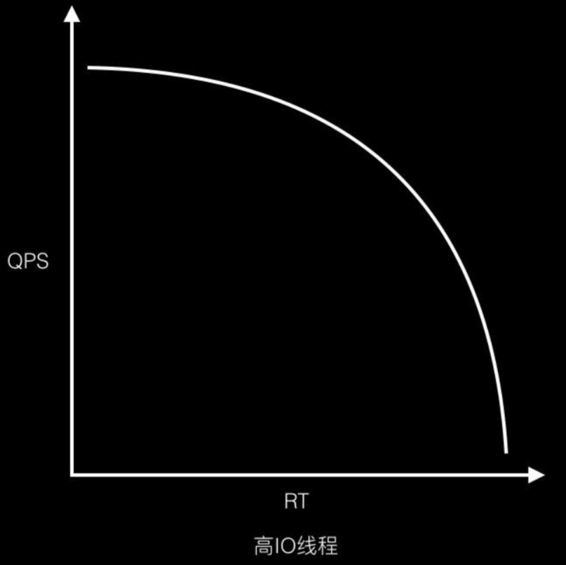

# 并发性能指标

## 1 QPS，每秒查询

QPS: Queries Per Second 是衡量信息检索系统（例如搜索引擎活数据库）在一秒内接收到的搜索流量的一种常见度量。该术语在任何请求-响应系统中都得到更广泛的使用，更正确地称为每秒请求数（RPS：Request Per Second）。

高性能、高并发、高可用（简称“三高”）要求的系统必须注意其QPS，才能知道何时扩容系统以处理更多请求。


### 1.1 理论计算：带宽与QPS的数学关系

#### 1.1.1 基础公式

* 带宽（单位Mbps，兆比特每秒）与**QPS**的关系为：

  $所需带宽（Mbps）=（请求大小+响应大小）\times QPS \times 8/1000000 （网络带宽、硬盘容量通常采用十进制）$

### 1.2 计算过程

```举个例子
平均请求大小：512字节 0.5KB
平均响应大小： 2048字节 2KB
	qps：3000
	所需总的数据带宽：（512+2048）* 3000字节/s
	转换为bit：（512+2048） * 3000 * 8 bps
	转换为Mbps： （512+2048）* 8 / 1000000 Mbps = 61.44Mbps
	数据传输效率单位 Mbps = 1000000 bps
所以100Mbps带宽（即12.5MBps）理论上可以支撑QPS3000。
```

### 1.3 实际影响因素分析

#### 1.3.1 单次请求的数据量差异

* 关键点：说单次请求的数据量增加（如大文件传输、高清视频流），带宽需求将成倍增长。
* 示例：若单次请求平均为5KB，QPS3000则所需带宽为120Mbps，超过100Mbps带宽。

#### 1.3.2 协议开销与网络损耗

* 协议开销：HTTP/HTTPS、TCP/IP协议头、DNS解析等会增加额外流量。
* 网络损耗：实际可用带宽通常低于理论值（如因延迟、丢包或者设备性能损失越10%~20%）。

#### 1.3.3 峰值波动

* 需要保留20-30%带宽余量应对突发流量
* 3000QPS均值下，峰值可能达到4500+ QPS

#### 1.3.4 上行速度与下行速度

* 上行影响请求数据的速率，下行影响获取数据的速度
* 运营商不同，上行与下行的比例也不一样，一般上行是下行的十分之一到十分之二左右


### 1.4 优化建议与解决方案

1. 降低单次请求数据量

* 压缩响应内容：启用GZIP压缩或使用CDN静态资源加速
* 优化协议：采用HTTP/2或者HTTP/3减少头部开销，使用二进制协议（如Protobuf）代替JSON。
* 做好接口的拆分：减少单次请求的数据体量

2. 缓存与CDN

* 缓存策越：对静态资源（图片、HTML）使用本地缓存（客户端缓存）或CDN加速。
* 动态内容缓存：通过Redis等缓存高频请求结果，减少后端计算压力。

3. 监控与测试

* 性能测试：使用工具（JMeter）模拟3000 QPS压力测试，验证实际带宽占用和服务器响应。
* 实时监控：部署监控工具（如Prometheus、Zabbix）跟踪带宽、CPU、内存等指标。


## 2 TPS，每秒事务

TPS：是Transactions Per Second的缩写，也就是事务数/秒。它是软件测试结果的测量单位。一个事务是指一个客户端向服务器发送请求然后服务器做出响应的过程。客户端在发送请求时开始计时，收到服务器响应后结束计时，以此来计算使用的时间和完成的事务个数。

QPS vs TPS：QPS基本类似于TPS，但是不同的是，对于一个页面的一次访问，形成一个TPS；但一次页面请求，可能产生多次对服务器的请求，服务器对这些请求，就可计入“QPS”之中。如，访问一个页面会请求服务器2次，一次访问，产生一个“T”，产生2个“Q”。


## 3 RT，响应时间

RT（Response-time）响应时间：执行一个请求从开始到最后收到响应数据所花费的总体时间，即从客户端发起请求到收到服务器响应结果的时间。该请求可以是任何东西，从内存获取，磁盘IO，复杂的数据库查询或加载完整的网页。

暂时忽略传输时间，响应时间是处理时间和等待时间的总和。处理时间是完成请求要求的工作所需的时间，等待时间是请求在被处理之前必须在队列中等待的时间。

响应时间是一个系统最重要的指标之一，它的数值大小直接反应了系统的快慢。


## 4 Concurrency，并发数

并发数是指系统同时能处理的请求数量，这个也反应了系统的负载能力。

并发意味着可以同时进行多个处理。并发在现代编程中无处不在，网络中有多台计算机同时存在，一台计算机上同时运行着多个应用程序。


## 5 吞吐量

系统的吞吐量（承压能力）和处理对CPU的消耗、外部接口、IO等因素紧密关联。单个处理请求对CPU消耗越高，外部系统接口、IO速度越慢，系统吞吐能力越低，反之越高。

系统吞吐量有几个重要指标参数：QPS（TPS）、并发数、响应时间。

1. QPS（TPS）：（Queries Per Second）每秒钟请求/事务数量。
2. 并发数： 系统同时处理的请求/事务数。
3. 响应时间： 一般取平均响应时间。

理解了上面三个指标的意义之后，就能推算出它们之间的关系：

- **QPS（TPS）= 并发数/平均响应时间**
- **并发数 = QPS\*平均响应时间**


## 6 实际举例

我们通过一个实例来把上面几个概念串起来理解。按二八定律来看，如果每天 80% 的访问集中在 20% 的时间里，这 20% 的时间就叫做峰值时间。

- 公式：( 总PV数 * 80% ) / ( 每天秒数 * 20% ) = 峰值时间每秒请求数(QPS)
- 机器：峰值时间每秒QPS / 单台机器的QPS = 需要的机器

1. **每天300w PV 的在单台机器上，这台机器需要多少QPS？**
   ( 3000000 * 0.8 ) / (86400 * 0.2 ) = 139 (QPS)
2. **如果一台机器的QPS是58，需要几台机器来支持？**
   139 / 58 = 3


## 7 最佳线程数、QPS、RT

**1、单线程QPS公式：QPS=1000ms/RT**
对同一个系统而言，支持的线程数越多，QPS越高。假设一个RT是80ms，则可以很容易的计算出QPS，QPS = 1000/80 = 12.5。

多线程场景，如果把服务端的线程数提升到2，那么整个系统的QPS则为 2*（1000/80） = 25，可见QPS随着线程的增加而线性增长，那QPS上不去就加线程呗，听起来是这个道理，但是往往现实并非如此。

**2、QPS和RT的真实关系**

我们想象中的QPS、RT关系如下，



实际的QPS、RT关系如下，



**3、最佳线程数量**
刚好消耗完服务器的瓶颈资源的临界线程数，公式如下
最佳线程数量=（（线程等待时间+线程cpu时间）/ 线程cpu时间）* cpu数量
特性：

- 在达到最佳线程数的时候，线程数量继续递增，则QPS不变，而响应时间变长，持续递增线程数量，则QPS开始下降。
- 每个系统都有其最佳线程数量，但是不同状态下，最佳线程数量是会变化的。
- 瓶颈资源可以是CPU，可以是内存，可以是锁资源，IO资源，超过最佳线程数-->导致资源的竞争，超过最佳线程数-->响应时间递增。


## 参考文献：

[一文搞懂高并发性能指标：QPS、TPS、RT、吞吐量 - 今日头条](https://www.toutiao.com/article/6762822597005541891/?wid=1751121279966)

[【Java面试】字节一面：100M网络带宽，能不能支撑qps3000？_哔哩哔哩_bilibili](https://www.bilibili.com/video/BV1UrK3z1EXq?buvid=XU17B211587DD3EE77CAA0287FABBE65E0558&from_spmid=tm.recommend.0.0&is_story_h5=false&mid=080DHD1dCN6xpPQqtokupA%3D%3D&plat_id=116&share_from=ugc&share_medium=android&share_plat=android&share_session_id=d76e1d39-f869-480d-b23d-76197d9b343a&share_source=COPY&share_tag=s_i&spmid=united.player-video-detail.0.0&timestamp=1751109957&unique_k=mOCiTHd&up_id=3493085409445971&vd_source=fbdc4dced00d004504f57fb2f6de726b)