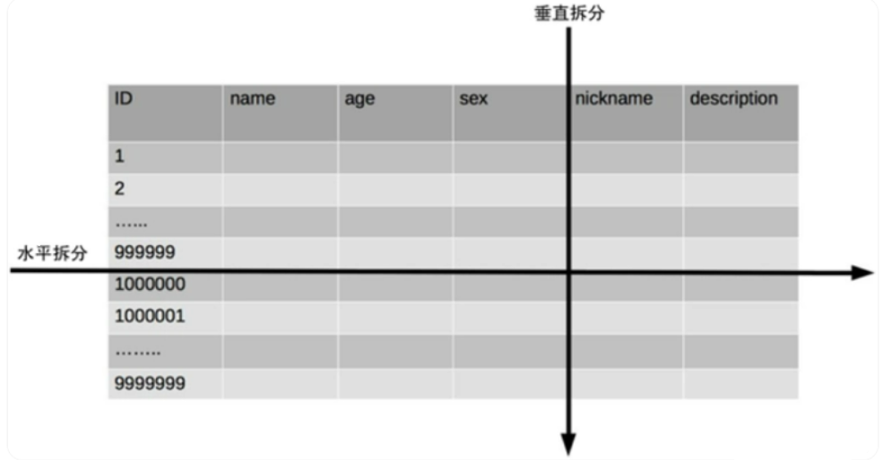

# 数据库读写分离和分库分表

---

## 1 什么是读写分离？

读写分离主要是将数据库的读写操作分散到不同的数据库节点上，这样就能`小幅度提升写性能`，`大幅度提升读性能`。

## 2 如何实现读写分离？

不管使用哪一种读写分离具体的实现方案，想要实现读写分离一般包括下面几个步骤：

1. 部署多台数据库，选择其中的一台作为主数据库，其他的一台或多台作为从数据库。
2. 保证主数据库和从数据库之间的数据是实时同步的，这个过程也就是我们常说的`主从复制`。
3. 系统将写请求交给主数据库处理，读请求交给从数据库处理。

落实到项目本身的话，常用的方式有两种：

1. **代理方式**

我们可以在应用和数据中间加了一个代理层。应用程序所有的数据请求都交给代理层处理，代理层负责分离读写请求，将它们路由到对应的数据库中。

提供类似功能的中间件有 MySQL Router（官方， MySQL Proxy 的替代方案）、Atlas（基于 MySQL Proxy）、MaxScale、MyCat。

关于MySQL Router多提一点：在MySQL8.2的版本中，MySQL Router能自动分辨对数据库读写/操作并把这些操作路由到正确的实例上。这是一项有价值的功能，可以优化数据库性能和可扩展性，而无需在应用程序中进行任何更改。

2. **组件方式**

在这种方式中，我们可以通过引入第三方组件来帮助我们读写请求。

这也是我比较推荐的一种方式。这种方式目前在各种互联网公司中用的最多的，相关的实际的案例也非常多。如果你要采用这种方式的话，推荐使用 `sharding-jdbc` ，直接引入jar包即可使用，非常方便。同时，也节省了很多运维的成本。

MySQL binlog(binary log 即二进制日志文件) 主要记录了MySQL 数据库中数据的所有变化(数据库执行的所有 DDL 和 DML 语句)。因此，我们根据主库的 MySQL binlog 日志就能够将主库的数据同步到从库中。

1. 主库将数据库中数据的变化写入到 binlog

2. 从库连接主库

3. 从库会创建一个 I/O 线程向主库请求更新的 binlog

4. 主库会创建一个 binlog dump 线程来发送 binlog ，从库中的 I/O 线程负责接收

5. 从库的 I/O 线程将接收的 binlog 写入到 relay log 中。

6. 从库的 SQL 线程读取 relay log 同步数据本地（也就是再执行一遍 SQL ）。

你一般看到 binlog 就要想到主从复制。当然除了主从复制之外，binlog还能帮助我们实现数据恢复。

**缺点：**

1. 资源浪费，数据做了冗余

2. 主库和从库的数据存在延迟。比如你写完主库之后，主库的数据同步到从库是需要时间的，这个时间差就导致了主库和从库的数据不一致性问题，这也就是我们经常说的 主从同步延迟 。

3. 网络不好的情况出现数据延迟,会出现主从数据库，数据不一致问题

4. 单表数据量超过4000w，数据还在增长还需要考虑分表

## 3 关于分库分表？

其实分库分表是牵扯到高并发的，因为分库分表无非来说就是为了支撑高并发、数据量大的问题。尤其进入稍微大一点的公司或者互联网公司，这些都是必须掌握的！比如一个新兴公司，刚开始时，注册用户就40W，每天活跃1W，每天单表数据量1000，高峰期每秒的并发就10，这种一般的单表单库操作就可以搞定。但是，当用户不断增加、日活跃用户增加、单表数据量增加、高峰期每秒增加到一定数量时，单表单库性能就存在很大的问题了。

## 4 为什么要分库分表？

据库出现性能瓶颈。用大白话来说就是数据库快扛不住了。

* 当单库或单表的数据量过大时，数据库的处理能力会受到限制，导致查询和写入操作变慢。分库分表通过将数据分散到多个数据库和表中，可以降低单库或单表的数据量，从而提高数据库的处理能力。
* 在高并发场景下，分库分表可以分散并发请求的压力，避免单个数据库或表成为性能瓶颈。
* 对于某些特定的查询或操作，分库分表可以优化查询性能，例如，通过将经常一起查询的数据放在同一个表中，可以提高查询效率。

|              | 分库分表前                  | 分库分表后                                   |
| ------------ | --------------------------- | -------------------------------------------- |
| 并发支持情况 | MySQL单机部署，看不住高并发 | MySQL从单机到多机，能承受的并发增加了多倍    |
| 磁盘使用情况 | MySQL单机磁盘容量几乎撑满   | 拆分为多个库，数据库服务器磁盘使用率大大降低 |
| SQL执行能力  | 单表数据量太大，SQL越跑越慢 | 单表数据量减少，SQL执行效率明显提升          |

## 5 什么是分库分表？

* 分库：从单个数据库拆分成多个数据库的过程，将数据散落在多个数据库中。
* 分表：从单张表拆分成多张表的过程，将数据散落在多张表内。

### 5.1 分为两种:

1. **垂直分表：**垂直分表在日常开发和设计中比较常见,通俗的说法叫做“大表拆小表" ,拆分是基于关系型数据库中的“列” (字段)进行的。通常情况,某个表中的字段比较多,可以新建立一张“扩展表”,将不经常使用或者长度较大的字段拆分出去放到“扩展表”中。

2. **水平分表：**水平分表也称为横向分表,比较容易理解，就是将表中不同的数据行按照一定规律分布到不同的数据库表中（这些表保存在同一个数据库中），这样来降低单表数据量，优化查询性能。最常见的方式就是通过主键或者时间等字段进行哈希和取模后拆分。

### 5.2 总结

* 垂直分表，可以理解为按列分表，如果一个表的字段太多了，可以按照使用频率分成不同的表，优化查询性能（就不用一次查询出所有的字段）。比如商品表可以分为商品类型表，商品详情表，商品促销表等等
* 垂直分库，为了减轻单个数据库压力，我们可以按照业务类型，拆分成多个数据库，比如分布式架构，不同的模块可以有不同的数据库
* 水平分表，可以理解为按行分表，如果一个表的数据有千万行，查询性能太低，可以拆分成10张小表，每张表保存一百万行数据【范围法，hash算法，雪花算法进行水平分表】
* 水平分库，我们做了水平分表后，表数量太多了也会影响数据库查询效率，我们可以将这些表分到多个数据库中。

## 参考文章：

[数据库读写分离(主从复制)和分库分表详解-CSDN博客](https://blog.csdn.net/2302_77971734/article/details/137191869)
