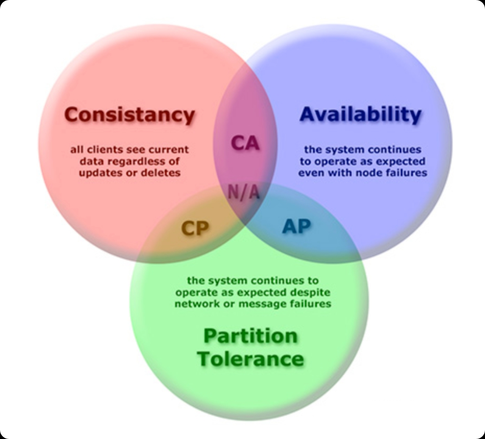
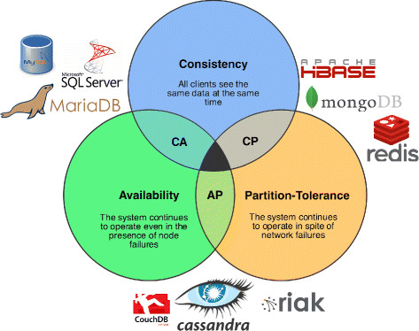
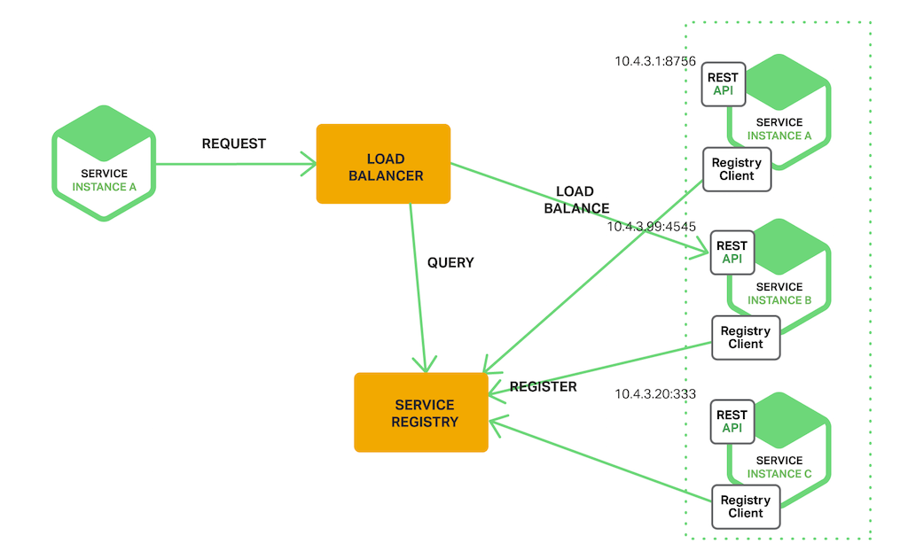

# 服务注册中心AP和CP的区别

## 1 一句话总结

* 一致性(Consistency) (等同于所有节点访问同一份最新的数据副本)
* 可用性(Availability)(每次请求都能获取到非错的响应——但是不保证获取的数据为最新数据)
* 分区容错性(Partition tolerance)(以实际效果而言，分区相当于对通信的时限要求。系统如果不能在时限内达成数据一致性，就意味着发生了分区的情况，必须就当前操作在C和A之间做出选择)

`AP`型注册中心：优先可用性，可能短暂不一致（如Nacos AP、Eureka）

`CP`型注册中心：优先一致性，必要时宁可不可用（如Nacos CP、Zookeeper）

本质是CAP定理的取舍



### 1.1 AP场景

“我宁愿调到**可能已经下线的服务**
 也不想**整个系统直接不可用**”

例子：

- 订单服务查库存服务
- 登录服务查用户服务
- 网关拉下游服务列表

➡️ **一次失败还能重试**
➡️ **系统整体不能死**

### 1.2 CP场景

“只要数据不确定，**宁可谁都别用**”

例子：

- 分布式锁
- Master 选举
- 配置中心（强一致）
- 全局唯一 ID 元数据

✔️ **CP 必须**


## 2 Nacos 为什么能同时支持 AP / CP？

这是 Nacos 很“工程化”的点 👇

| 功能         | 模式           |
| ------------ | -------------- |
| 服务注册发现 | **AP（默认）** |
| 配置管理     | **CP**         |
| 临时实例     | AP             |
| 持久化实例   | CP             |

### 2.1 Nacos 切换方式

```yaml
spring:
  cloud:
    nacos:
      discovery:
        ephemeral: true   # true = AP（默认）
```

- `true` → AP（临时实例，心跳）

- `false` → CP（持久化实例，强一致）




