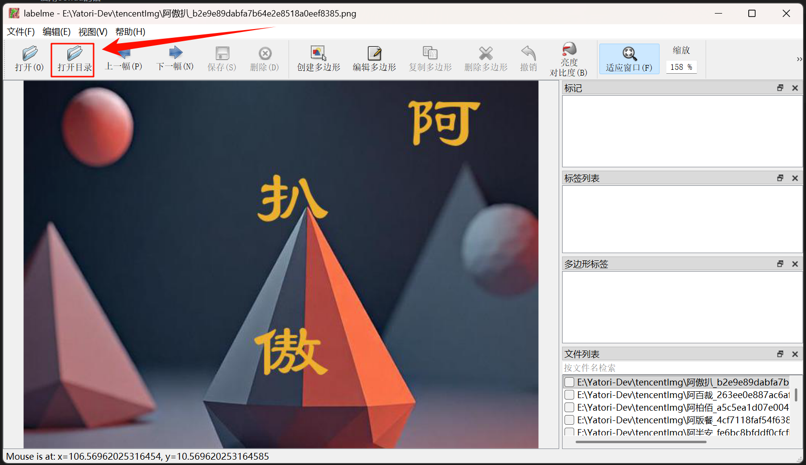
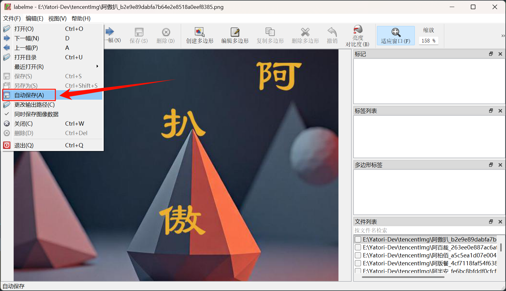
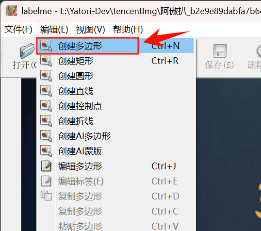
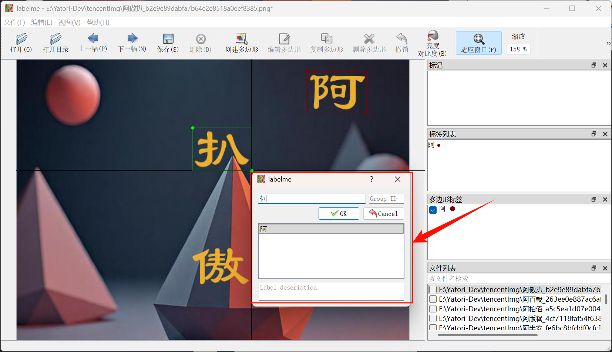
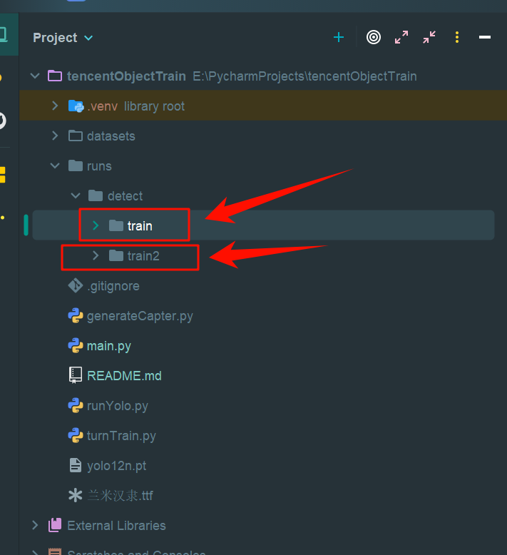
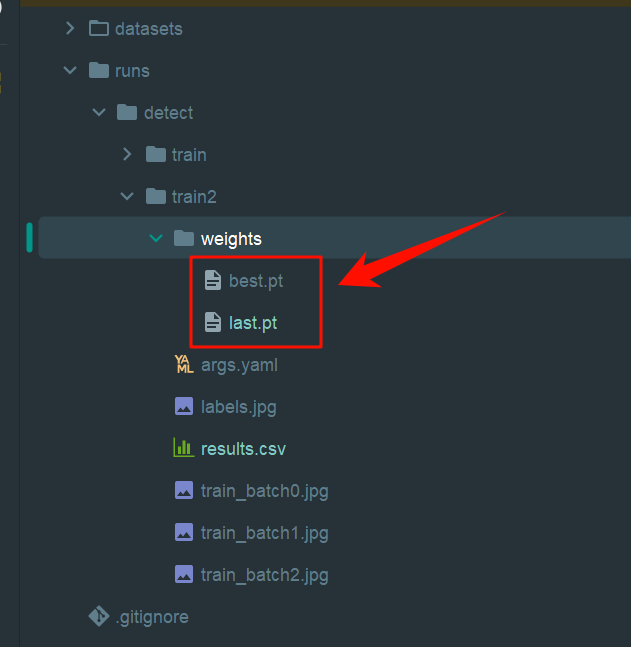

# 利用YOLO进行目标识别训练

---


## 1 安装YOLO

```shell
pip install ultralytics
```

使用conda的话

```
conda create -n yolov12 python=3.11
conda activate yolov12
```


下载好依赖后可以先尝试

```python
from ultralytics import YOLO

# Load a COCO-pretrained YOLO12n model
model = YOLO("yolo12n.pt")

# Train the model on the COCO8 example dataset for 100 epochs
results = model.train(data="coco8.yaml", epochs=100, imgsz=640)

# Run inference with the YOLO12n model on the 'bus.jpg' image
results = model("path/to/bus.jpg")
```


## 2 使用标注软件

可以先在[Releases · wkentaro/labelme](https://github.com/wkentaro/labelme/releases)下载标注软件，这里使用的是labelme

### 2.1 打开需要训练的训练集文件夹

下载打开后，直接打开目录到对应需要训练的图片集文件夹



### 2.2 更改训练集输出路径

再更改输出路径到自己想要的位置


- 建议启用 **“自动保存”** 功能（通过 **“文件(F)” -> “自动保存”** 启用），确保标注工作实时保存，避免数据丢失。




### 2.3 标注数据

选择目标图像后，在工具栏中选择 **“编辑(E)” -> “创建多边形”**，进入标注框绘制模式



使用鼠标在图像上点击以创建多边形的边界点，根据需要绘制目标区域的边界。

弹出对话框后，输入标签名称（如“apple”或其他目标名称），以便于分类和管理。

确认无误后，点击 **“OK”** 按钮保存标注内容，系统将自动生成对应的 JSON 格式标注文件。




## 3 LabelMe标注集转Yolo训练集

我们在使用LabelMe标注好数据集后是不能直接用的，因为LabelMe的数据集是json格式，而yolo则是纯文本，所以必须要进行相关的转换。这里需要自行写相关的代码进行转换，我这里就直接提供转换的代码了：

```python
import json
import os
from pathlib import Path
from shutil import copy2

# 输入 LabelMe JSON 的目录
labelmeLabel_dir = "E:\\Yatori-Dev\\tencentData" 
# 输入 LabelMe 图片 的目录
labelmeImg_dir = "E:\\Yatori-Dev\\tencentImg"
# 输出 YOLO 数据集目录
output_dir = "datasets/yolo_dataset"
img_out_dir = Path(output_dir) / "train" / "train"
lbl_out_dir = Path(output_dir) / "labels" / "train"

os.makedirs(img_out_dir, exist_ok=True)
os.makedirs(lbl_out_dir, exist_ok=True)

all_classes = set()

# 遍历所有 LabelMe JSON
for json_file in Path(labelmeLabel_dir).rglob("*.json"):
    with open(json_file, "r", encoding="utf-8") as f:
        data = json.load(f)

    img_w = data["imageWidth"]
    img_h = data["imageHeight"]

    # 处理 imagePath
    img_path = Path(labelmeImg_dir) / Path(data["imagePath"]).name

    # 拷贝图片
    if img_path.exists():
        copy2(img_path, img_out_dir / img_path.name)

    # YOLO 标签文件
    txt_path = lbl_out_dir / (json_file.stem + ".txt")
    with open(txt_path, "w", encoding="utf-8") as out:
        for shape in data["shapes"]:
            label = shape["label"]
            all_classes.add(label)

            (x1, y1), (x2, y2) = shape["points"]
            x_min, x_max = min(x1, x2), max(x1, x2)
            y_min, y_max = min(y1, y2), max(y1, y2)

            # 转 YOLO 格式（归一化）
            x_center = (x_min + x_max) / 2 / img_w
            y_center = (y_min + y_max) / 2 / img_h
            w = (x_max - x_min) / img_w
            h = (y_max - y_min) / img_h

            out.write(f"{label} {x_center} {y_center} {w} {h}\n")

# ---- 构建类别映射 ----
all_classes = sorted(list(all_classes))
class_to_id = {c: i for i, c in enumerate(all_classes)}

# 替换标签里的类别名 → id
for txt_file in lbl_out_dir.rglob("*.txt"):
    lines = []
    with open(txt_file, "r", encoding="utf-8") as f:
        for line in f:
            parts = line.strip().split()
            if not parts:
                continue
            label = parts[0]
            if label not in class_to_id:
                continue
            cls_id = class_to_id[label]
            new_line = f"{cls_id} " + " ".join(parts[1:])
            lines.append(new_line)
    with open(txt_file, "w", encoding="utf-8") as f:
        f.write("\n".join(lines))

# ---- 生成 data.yaml ----
yaml_path = Path(output_dir) / "data.yaml"
with open(yaml_path, "w", encoding="utf-8") as f:
    # 这里记得修改
    f.write(f"train: E:\\PycharmProjects\\tencentObjectTrain\\datasets\\yolo_dataset\\train\\train") 
    # 这里记得修改
    f.write(f"val: E:\\PycharmProjects\\tencentObjectTrain\\datasets\\yolo_dataset\\train\\train")
    # f.write(f"train: {output_dir}/train/train\n")
    # f.write(f"val: {output_dir}/train/train  # 这里暂时用train当val，建议再划分\n\n")
    f.write(f"nc: {len(all_classes)}\n")
    f.write("names: " + str(all_classes) + "\n")

print("✅ 转换完成！")
print("类别列表:", all_classes)
print("data.yaml 已生成:", yaml_path)
```

转换完后就可以直接敲代码进行训练了

## 4 开始模型训练

注意这里data_yaml就是上面模板转换后输出的data.yaml文件

```python
from ultralytics import YOLO
from pathlib import Path

# ---- 1. 加载预训练 YOLOv12n 模型 ----
model = YOLO("yolo12n.pt")  # 也可以换成 yolo12s.pt/yolo12m.pt 等

# ---- 2. 定义数据集 YAML ----
# 假设你之前生成的 data.yaml 路径
data_yaml = "datasets/yolo_dataset/data.yaml"

# ---- 3. 训练模型 ----
# 这里验证码识别使用了generateCapter生成的3500张图片进行，其实训练45轮就已经效果非常好了
results = model.train(
    data=data_yaml,   # 数据集配置文件
    epochs=100,       # 训练轮数
    imgsz=640,        # 输入图片尺寸
    batch=16,         # 可根据显存调节
    device='cpu'          # 0 表示第一块 GPU，改成 'cpu' 用 CPU
)
```

yolo训练模型有个好处就是每次一轮训练就会进行保存，所以就算你中途程序突然崩溃也不要紧，当前轮的训练权重还是在的，你甚至还能继续训练。

训练的数据将会在`runs/detect/...`里面这里每一份`train`就是一份训练结果或训练中的数据。



其中`weights`里面便是训练好的模型，其中`best.pt`指的是训练效果或者说正确率最高的模型，`last.pt`则是最后一次训练轮数的模型，这些模型是可以直接在yolo加载使用的，一般来说我们都会选择`best.pt`模型。



## 5 测试模型

这里`model`变量要加载对应训练好的模型

```python
from ultralytics import YOLO


# 加载训练好的模型
model = YOLO("runs/detect/train2/weights/best.pt")

# 对图片进行检测
results = model("E:\\Yatori-Dev\\tencentImg\\熬沉豹_fa705c7235bfe41a605e29a967044a69.png")
# results = model("E:\\PycharmProjects\\tencentObjectTrain\\CCC\images\\4.png")
# 获取检测框信息（xyxy坐标, 置信度, 类别）
boxes = results[0].boxes

# 转成 Python 列表 [(置信度, x1, y1, x2, y2, cls), ...]
detections = []
for box in boxes:
    conf = float(box.conf)   # 置信度
    xyxy = box.xyxy.cpu().numpy().flatten().tolist()  # 边框
    cls = int(box.cls)       # 类别ID
    detections.append((conf, *xyxy, cls))

# 按置信度排序
detections = sorted(detections, key=lambda x: x[0], reverse=True)

# 取前3个目标
top3 = detections[:3]

print("Top 3 detections:")
for i, det in enumerate(top3, 1):
    conf, x1, y1, x2, y2, cls = det
    print(f"{i}. Class={cls} [{words[cls]}], Conf={conf:.2f}, Box=({x1:.0f},{y1:.0f},{x2:.0f},{y2:.0f})")

# 如果要在图上只画前3个框：
import cv2
import matplotlib.pyplot as plt

img = results[0].orig_img.copy()
for det in top3:
    conf, x1, y1, x2, y2, cls = det
    cv2.rectangle(img, (int(x1), int(y1)), (int(x2), int(y2)), (0,255,0), 2)
    cv2.putText(img, f"{cls} {conf:.2f}", (int(x1), int(y1)-5),
                cv2.FONT_HERSHEY_SIMPLEX, 0.6, (0,255,0), 2)

plt.imshow(cv2.cvtColor(img, cv2.COLOR_BGR2RGB))
plt.axis("off")
plt.show()
```

