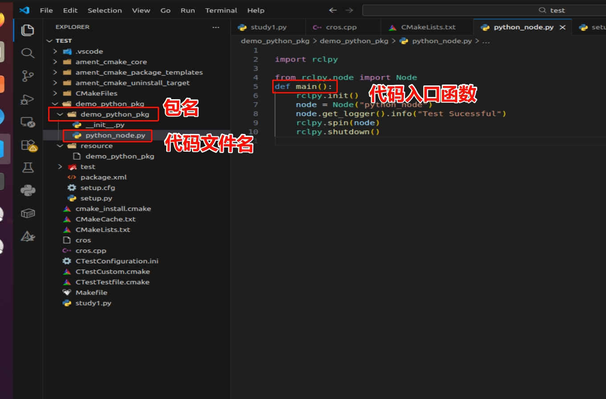
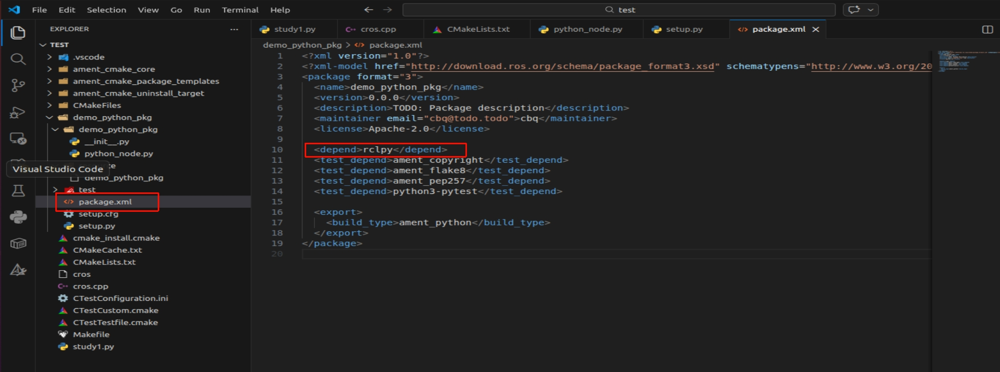

# ROS2功能代码学习

## 节点篇

修改日志输出格式

```shell
export RCUTILS_CONSOLE_OUTPUT_FORMAT=[{function_name}:{line_number}]:{message}
```


### 如何创建一个可执行的功能包


#### python

创建一个功能包

```shell
ros2 pkg create --build-type ament_python --license Apache-2.0 demo_python_pkg
```

创建完成后需要如果我要写代码

使用节点代码例子：

```python
import rclpy
from rclpy.node import Node


def main():
    rclpy.init()
    node = Node("python_node")
    node.get_logger().info("输出日志")
    node.get_logger().warn("输出日志")
    rclpy.spin(node)
    rclpy.shutdown()

if __name__=='__main__':
    main()
```

写完之后我们需要在setup.py中进行配置入口

```python
from setuptools import setup

package_name = 'demo_python_pkg'

setup(
    name=package_name,
    version='0.0.0',
    packages=[package_name],
    data_files=[
        ('share/ament_index/resource_index/packages',
            ['resource/' + package_name]),
        ('share/' + package_name, ['package.xml']),
    ],
    install_requires=['setuptools'],
    zip_safe=True,
    maintainer='cbq',
    maintainer_email='cbq@todo.todo',
    description='TODO: Package description',
    license='Apache-2.0',
    tests_require=['pytest'],
    entry_points={
        'console_scripts': [
            'python_node = demo_python_pkg.python_node:main' #这里配置的入口，其遵循格式为：[别名] = 包名.代码文件名.函数名
        ],
    },
)

```



同时记的在包管理中添加对应的依赖，因为我们在上面代码中加了rclpy依赖包



弄完之后即可直接用以下命令进行构建了：

```shell
colcon build
```

#### C++

创建包

```shell
ros2 pkg create --build-type ament_cmake --license Apache-2.0 demo_cpp_pkg
```

然后在对应创建好的包的src文件夹里面创建c++代码文件，之后在CMakeLists.txt中添加对应的编译信息：

```cmake
find_package(rclcpp REQUIRED)
add_executable(cpp_node src/cpp_node.cpp)


message(STATUS ${rclcpp_INCLUDE_DIRS}) # 头文件及rclcpp依赖的头文件
message(STATUS ${rclcpp_LIBRARIES}) # 库文件及rclcpp依赖的头文件

target_include_directories(cpp_node PUBLIC ${rclcpp_INCLUDE_DIRS}) #头文件包含

target_link_libraries(cpp_node ${rclcpp_LIBRARIES}) #库文件链接

# ament_target_dependencies(cpp_node rclcpp)
install(TARGETS cpp_node lib/${PROJECT_NAME})
```

加完后的文件是这个样子的：

```cmake
cmake_minimum_required(VERSION 3.5)
project(demo_cpp_pkg)

# Default to C99
if(NOT CMAKE_C_STANDARD)
  set(CMAKE_C_STANDARD 99)
endif()

# Default to C++14
if(NOT CMAKE_CXX_STANDARD)
  set(CMAKE_CXX_STANDARD 14)
endif()

if(CMAKE_COMPILER_IS_GNUCXX OR CMAKE_CXX_COMPILER_ID MATCHES "Clang")
  add_compile_options(-Wall -Wextra -Wpedantic)
endif()

# find dependencies
find_package(ament_cmake REQUIRED)
find_package(rclcpp REQUIRED)
# uncomment the following section in order to fill in
# further dependencies manually.
# find_package(<dependency> REQUIRED)
add_executable(cpp_node src/cpp_node.cpp)


message(STATUS ${rclcpp_INCLUDE_DIRS}) # 头文件及rclcpp依赖的头文件
message(STATUS ${rclcpp_LIBRARIES}) # 库文件及rclcpp依赖的头文件

target_include_directories(cpp_node PUBLIC ${rclcpp_INCLUDE_DIRS}) #头文件包含

target_link_libraries(cpp_node ${rclcpp_LIBRARIES}) #库文件链接

install(TARGETS cpp_node
  DESTINATION lib/${PROJECT_NAME}
)

# ament_target_dependencies(cpp_node rclcpp)
if(BUILD_TESTING)
  find_package(ament_lint_auto REQUIRED)
  # the following line skips the linter which checks for copyrights
  # uncomment the line when a copyright and license is not present in all source files
  #set(ament_cmake_copyright_FOUND TRUE)
  # the following line skips cpplint (only works in a git repo)
  # uncomment the line when this package is not in a git repo
  #set(ament_cmake_cpplint_FOUND TRUE)
  ament_lint_auto_find_test_dependencies()
endif()

ament_package()

```

注意代码不要放在ament_package()之后，容易出问题。


注意C++情况下目录结构为：

```shell
demo_cpp_pkg
	- include/demo_cpp_pkg   #这个是放头文件
	- src					#这个是放普通代码文件
```


### 工作空间

一个完整的机器人项目往往由多个不同的功能模块组成，所以就需要对多个功能包进行组合。

ROS2开发者约定了Workspace--即工作空间这一概念


```shell
mkdir -p chapt2_ws/src #创建多层文件夹，注意创建多层文件夹时要加参数-p
```


将功能包移动到工作空间下，然后把之前编译的文件等删掉：

```shell
mv demo_cpp_pkg/ chapt2_ws/src/
mv demo_python_pkg/ chapt2_ws/src/
rm -rf build/ install/ log/
```


如果只构建一个功能包：

```shell
colcon build --packages-select demo_cpp_pkg
```


C++中的lambda表达式

写法公式：

```shell
[capture list](parameters) -> return_type {function body}
```

如果capture list写`&`那说明上文中的参数都可以捕获

例子：

```c++
#include<iostream>
int main()
{
    auto fc = [](int a,int b)->int{return a+b;};
    int sum = fc(1,2);
    auto pss = [&]()->int{return sum+1;};
    std::cout<<sum<<""<<" "<< pss()<<std::endl;
    /* code */
    return 0;
}
```


## 话题篇


## 工具篇

通过命令行使用TF|3D旋转可视化

```shell
sudo apt install ros-foxy-mrpt2
3d-rotation-converter
```

