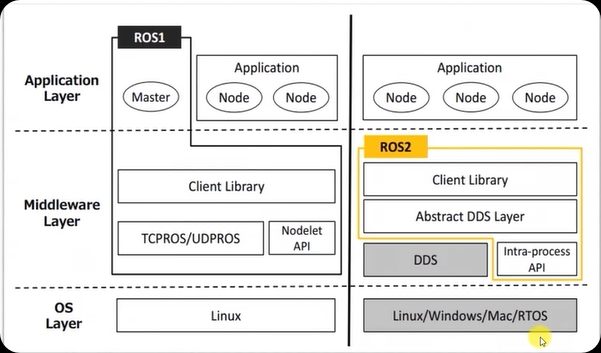

# ROS2对比ROS1

---

很好 👍
那我给你一份**偏工程实现 + 技术原理 + 架构逻辑**的完整技术笔记，而不是面试向内容。

下面内容偏“系统理解 + 工程视角 + 自动驾驶落地逻辑”。

------

## 一、ROS 本质：一个分布式机器人中间件框架

ROS = 通信框架 + 工具链 + 组件化组织方式。

核心目标：

> 把一个复杂机器人系统拆成可组合的分布式模块。

------

### 1.1 核心抽象

#### 1️⃣ Node（进程级模块）

每个算法/驱动/控制器是一个独立进程。

例如：

- camera_driver
- lidar_driver
- localization_node
- planning_node
- control_node

------

#### 2️⃣ Topic（数据流通道）

发布-订阅模型：

```
Sensor → Perception → Prediction → Planning → Control
```

特点：

- 单向流
- 无阻塞
- 异步
- 多对多

适合：

- 高频数据（图像、点云、IMU）
- 状态流（odom、trajectory）

------

#### 3️⃣ Service（同步RPC）

请求-响应模型：

```
Client ----> Server
```

适合：

- 配置请求
- 模式切换
- 参数获取

------

#### 4️⃣ Action（长时间任务）

带反馈的异步任务：

```
Goal → Feedback → Result
```

适合：

- 导航到目标点
- 自动泊车过程

------

### 1.2 数据结构设计原则

ROS 消息设计遵循：

- 强类型
- 序列化可跨语言
- 时间戳强依赖
- 坐标系明确

核心字段：

```
std_msgs/Header
{
    stamp
    frame_id
}
```

自动驾驶里：

- 时间戳决定融合
- frame_id 决定坐标转换

------

## 二、ROS1 vs ROS2：架构层面对比

------

OS

* ROS1:Linux
* ROS2:Linux、Windows、MAC、RTOS

通讯

* ROS1：TCPROS/UDPROS
* ROS2：DDS

节点模型

* ROS1：publish/subscribe
* ROS2：discovery

进程

* ROS1：Nodelet
* ROS2：Intra-process



### 2.1 通信架构差异

#### ROS1 架构

```
          ROS Master
             |
  --------------------------
  |        |        |      |
 NodeA   NodeB   NodeC   NodeD
```

- 所有节点注册到 Master
- Master 负责发现
- 通信建立后点对点

缺点：

- Master 单点
- 网络复杂场景扩展困难
- 无 QoS

------

#### ROS2 架构（基于 DDS）

```
 NodeA  <----DDS---->  NodeB
 NodeC  <----DDS---->  NodeD
```

特点：

- 无中心
- 自动发现
- 内置 QoS
- 支持实时系统
- 支持安全

DDS 提供：

- 数据分发服务
- 可靠性控制
- 历史缓存
- 流控

------

### 2.2 QoS 机制（ROS2 核心）

关键参数：

#### Reliability

- reliable
- best_effort

#### Durability

- volatile
- transient_local

#### History

- keep_last
- keep_all

#### Depth

- 缓冲队列长度

自动驾驶常见策略：

| 数据类型     | QoS             |
| ------------ | --------------- |
| Camera       | best_effort     |
| Lidar        | best_effort     |
| Control Cmd  | reliable        |
| Localization | reliable        |
| Map          | transient_local |

------

### 2.3 Lifecycle 节点机制

状态机：

```
unconfigured
    ↓
inactive
    ↓
active
    ↓
finalized
```

自动驾驶好处：

- 启动顺序可控
- 故障可回退
- 模块可热重启

------

## 三、ROS 在自动驾驶系统中的架构角色

------

### 3.1 自动驾驶系统模块化结构

典型数据流：

```
Sensors
  ↓
Perception
  ↓
Prediction
  ↓
Planning
  ↓
Control
  ↓
Vehicle
```

每个模块是一个或多个 ROS Node。

------

### 3.2 坐标系统（TF）

核心坐标系：

- map
- odom
- base_link
- lidar_link
- camera_link

变换链：

```
map
  ↓
odom
  ↓
base_link
  ↓
sensor_link
```

自动驾驶中：

- 地图坐标用于全局定位
- odom 用于短时连续
- base_link 为车体中心

------

### 3.3 自动驾驶数据同步逻辑

关键问题：

多传感器时间不同步会导致融合错误。

解决方案：

- 硬件时间同步（PTP）
- 时间戳统一
- 消息过滤器同步
- 延迟补偿

------

## 四、自动驾驶中的 ROS 工作流程（工程角度）

------

### 4.1 启动流程

1. 加载参数
2. 启动传感器驱动
3. 初始化定位
4. 激活感知模块
5. 激活规划
6. 激活控制
7. 进入自动驾驶状态

------

### 4.2 运行时逻辑

#### 感知

输入：

- 点云
- 图像
- IMU

输出：

- 目标列表
- 车道线
- 障碍物

------

#### 规划

输入：

- 当前位姿
- 障碍物
- 目标点

输出：

- 轨迹点序列

------

#### 控制

输入：

- 轨迹
- 当前速度

输出：

- 转向角
- 加速度

------

## 五、ROS 工程组织结构

------

### 5.1 包结构

```
package/
 ├── src/
 ├── include/
 ├── launch/
 ├── config/
 ├── msg/
 ├── CMakeLists.txt
 └── package.xml
```

------

### 5.2 Launch 系统

ROS1：

- XML

ROS2：

- Python launch

优势：

- 参数化
- 条件启动
- 生命周期管理

------

## 六、ROS 在自动驾驶中的优势与局限

------

### 优势

- 快速原型开发
- 模块解耦
- 生态丰富
- 可视化调试方便

------

### 局限

- 默认非强实时
- 序列化开销
- 进程多带来上下文切换
- 高性能系统需深度优化

------

## 七、自动驾驶系统中常见优化方向

------

### 1️⃣ 进程内通信（ROS2 composition）

减少：

- 序列化
- 拷贝

------

### 2️⃣ 零拷贝机制

- loaned messages
- intra-process comm

------

### 3️⃣ 多线程执行器

- MultiThreadedExecutor

------

### 4️⃣ CPU 绑定

- 核心模块绑核
- 提升实时性

------

## 八、ROS 与自动驾驶框架关系

------

### Autoware

- 基于 ROS
- 自动驾驶完整栈

------

### Apollo

- 不基于 ROS
- 自研 CyberRT
- 类 ROS 但更偏工业化

------

## 九、自动驾驶系统中的基本逻辑模型

------

### 1️⃣ 状态机

系统模式：

- Manual
- Autonomous
- Emergency

------

### 2️⃣ 事件驱动

- 感知更新 → 触发规划
- 规划更新 → 触发控制

------

### 3️⃣ 数据流图（核心）

自动驾驶本质是：

```
感知 → 状态估计 → 决策 → 轨迹生成 → 控制
```

ROS 负责：

- 模块连接
- 数据调度
- 参数管理
- 可视化
- 日志记录

------

