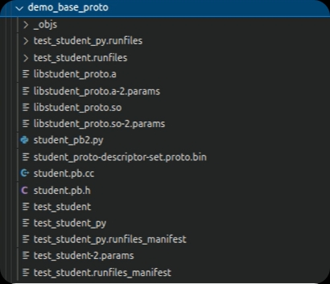

# protobuf基础

---

## 概念

protobuf 全称 Protocol buffers，是 Google 研发的一种跨语言、跨平台的序列化数据结构的方式，是一个灵活的、高效的用于序列化数据的协议。


## 特点

在序列化数据时常用的数据格式还有XML、JSON等，相比较而言，protobuf更小、效率更高且使用更为便捷，protobuf内置编译器，可以将protobuf 文件编译成 C++、Python、Java、C#、Go 等多种语言对应的代码，然后可以直接被对应语言使用，轻松实现对数据流的读或写操作而不需要再做特殊解析。


Protobuf的有点如下：

1.`高效`:序列化后字节占用空间比XML少3-10倍，序列化的时间效率比XML快20-100倍；

2.`便捷`:可以将结构化数据封装为类，使用方便；

3.`跨语言`:支持多种编程语言；

Protobuf也有缺点：

1.二进制格式易读性差；

2.缺乏自描述。


## 基本使用流程

在bazel中已经集成了protobu的编译器，所以我们直接使用即可，接下来我们就通过一个案例来演示protobuf 的基本使用，需求如下:

> 创建protobuf文件，在该文件中需要申明学生的姓名、年龄、身高、所有的书籍......等信息，然后分别使用C++和Python实现学生数据的读写操作。

该需求实现大致流程如下：

1.编写proto文件；

2.配置BUILD文件，编译生成对应的C++或Python文件；

3.在C++或Python中调用。

同一proto文件，是可以被多种语言使用的，所以在演示C++和Python调用proto之前，我们可以编写proto文件并通过案例来学习一些proto的基本语法，后学习如何在C++h和Python中调用proto。


### proto使用之文件创建

#### 创建proto文件

在`/apollo/cyber`目录下新建文件夹demo_base_proto，文件夹下新建文件student.proto,并输入如下内容：

```protobuf
// 使用的proto版本，Cyber RT中目前使用的是proto2
syntax = "proto2";
//包
package apollo.cyber.demo_base.proto;

//消息，---message是关键字，Student消息名称
message Student {
	//字段
	//字段格式：字段规则 数据类型 字段名称 字段编号
	required string name = 1;
	optional uint64 age = 2;
	optional double height = 3;
	repeated string books = 4;
}
```

proto中的字段语法，字段就格式而言主要有四部分组成：字段规则、数据类型、字段名称、字段编号，接下来分别介绍一下这四种格式。

1.字段规则

字段类型主要有如下三种：

* required:调用时，必须提供该字段的值，否则该消息将被是为“未初始化“，不建议使用，当需要把字段修改为其他规则时，会存在兼容性问题。
* optional:调用时该字段的值可以设置也可以不设置，不设置时，会根据数据类型生成默认值。
* required:该g追责字段可以以动态数组的方式存储多个数据。

2.数据类型

protobuf中的数据类型与不同的编程语言存在一定的映射关系，具体可参考官方资料，如下：

Protobuf与主要语言类型对照表

| .proto 类型 | C++        | Java         | Python        | Go        |
| :---------- | :--------- | :----------- | :------------ | :-------- |
| `double`    | `double`   | `double`     | `float`       | `float64` |
| `float`     | `float`    | `float`      | `float`       | `float32` |
| `int32`     | `int32_t`  | `int`        | `int`         | `int32`   |
| `int64`     | `int64_t`  | `long`       | `int/long`    | `int64`   |
| `uint32`    | `uint32_t` | `int`        | `int/long`    | `uint32`  |
| `uint64`    | `uint64_t` | `long`       | `int/long`    | `uint64`  |
| `bool`      | `bool`     | `boolean`    | `boolean`     | `bool`    |
| `string`    | `string`   | `String`     | `str/unicode` | `string`  |
| `bytes`     | `string`   | `ByteString` | `str`         | `[]byte`  |
| `map<K,V>`  | `std::map` | `Map`        | `dict`        | `map`     |

3.字段名称

字段名称就是变量名称，其命名规则参考C++中的变量名命名规则即可。

4.字段编号

每个字段都有一个唯一编号，用于在消息的二进制格式中标识字段。


### proto文件编译

在demo_base_proto目录下新建BUILD文件，并输入以下内容：

```bazel
load("//tools:python_rules.bzl","py_proto_library")
package(default_visibility= ["//visibility:public"])
proto_library(
	name = "student_proto",
	srcs = ["student.proto"]
)

cc_proto_library(
	name = "student_cc",
	deps = [":student_proto"]
)

py_proto_library(
	name = "student_py",
	deps = [":student_proto"]
)
```

代码解释：

1.proto_library函数

该函数用于生成proto文件对应的库，该库被其他编程语言创建依赖库时所依赖。

参数：

* name 目标名称
* src proto文件

2.cc_proto_library函数

该函数时用于生成C++相关的proto依赖库。

参数：

* name目标名称
* deps依赖的proto库名称

3.py_proto_library函数

该函数用于生成Python相关的proto依赖库。

参数：

* name目标名称
* deps依赖的proto库名称

注意：

1.使用py_proto_library必须申明load("//tools:python_rules.bzl","py_proto_library")。

2.proto_library函数的参数name值必须是后缀_proto否则，python调用时会抛出异常。

3.为了方便后期使用，建议先添加语句：package(default_visibility=["//visibility:public"])。


### 编译

终端下进入/apollo目录，执行编译命令：

```shell
bazel build cyber/demo_base_proto/...
```

在/apollo/bazel-bin/cyber/demo_base_proto下将生成可以被C++和Python调用的中间文件。

