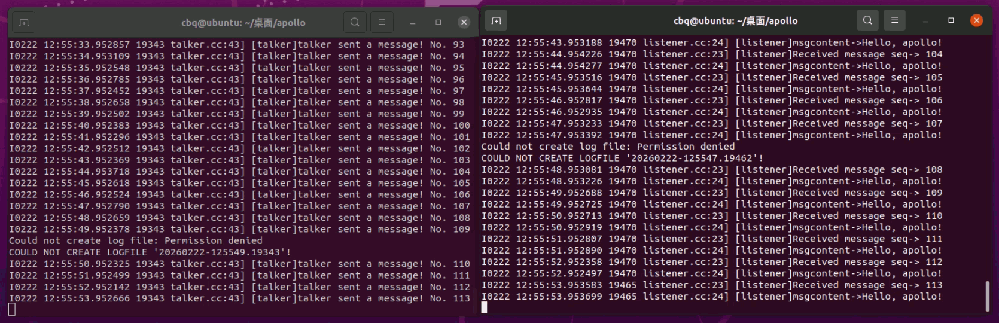
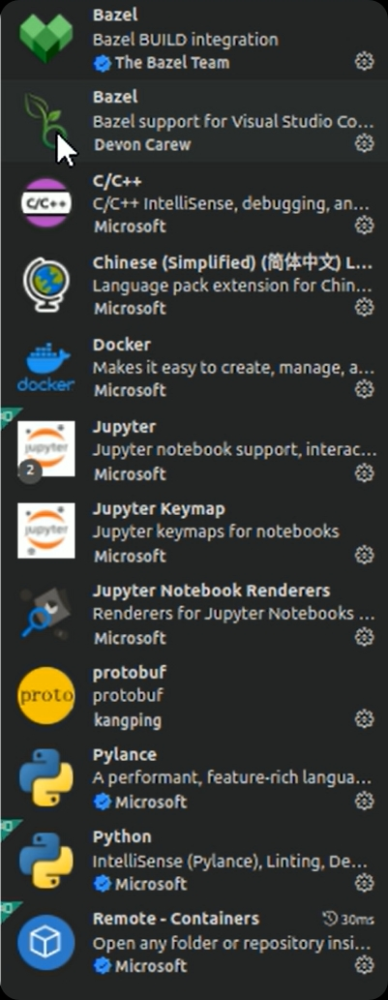
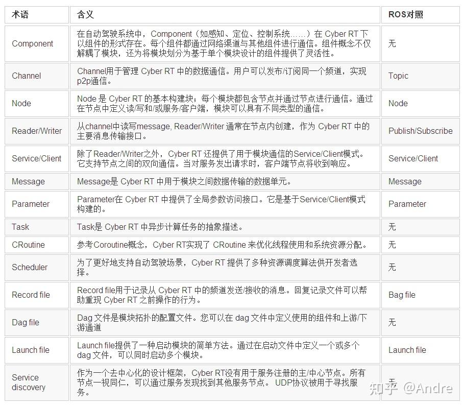
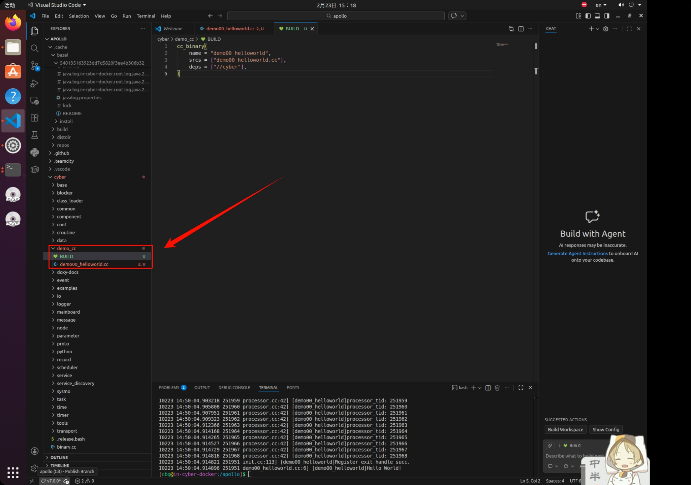

# 百度Apollo

## 1 关于

---

Baidu Apollo(阿波罗)是百度发布的自动驾驶计划，包括开放平台及企业版解决方案。Apollo开放平台面向所有开发者提供最开放、完整、安全的自动驾驶开源平台。


## 2 准备工作

---

在正式安装Apollo或C有e人RT之前，需要先准备基础环境，基础环境主要包含如下内容：

1.安装Ubuntu Linux

2.安装NVIDIA GPU驱动(可选)；

3.安装docker；

4.安装NVIDIA Container Toolkit。

具体的安装流程可以参考[Apollo官方安装向导](https://github.com/ApolloAuto/apollo/blob/master/docs/%E5%AE%89%E8%A3%85%E6%8C%87%E5%8D%97/Installation%20Guide.md)


## Cyber RT安装

### 拉取Apollo源码

克隆 Apollo源码仓库:

```shell
git clone https://github.com/ApolloAuto/apollo.git
```

GitHub在国内访问速度可能很慢，可以使用Gitee替代:

```shell
git clone https://gitee.com/ApolloAuto/apollo.git
```


### 启动Apollo Docker 开发容器

进入到Apollo源码根目录，执行下述命令以启动Apollo Dock测人开发容器：

```shell
./docker/scripts/dev_start.sh
```

如果只是使用Cyber RT可以执行:

```shell
./docker/scripts/cyber_start.sh
```

或(国内建议选择此项,速度更快):

```shell
./docker/scripts/cyber_start.sh -g cn
```


### 进入Apollo Docker开发容器

启动Apollo Docker 开发容器后，执行下述命令进入容器:

```shell
./docker/scripts/dev_into.sh
```

如果只是使用Cyber RT可以执行:

```shell
./docker/scripts/cyber_into.sh
```

可以发现，进入容器后终端信息发生了相应变化，后面的操作将在容器中进行。


### 在容器中构建Apollo

进入Apollo Docker 开发容器后，在容器终端中执行下述命令构建Apollo:

```shell
./apollo.sh build
```

如果只是使用Cyber RT可以执行:

```shell
./apollo.sh build cyber
```

> `注`:如果报无权限相关异常，在命令前加sudo即可，如遇其他错误，重新执行命令直至成功。


## 测试

测试前准备:

默认情况下，cyber的日志信新城是写出到磁盘文件，而不会在终端输出，为了方便查看运行结果，我们需要修改cyber的配置文件，使其能够将日志信息输出在终端，具体操作如下：

1.打开配置文件

```shell
vi cyber/setup.bash
```

2.修改并退出编辑器

文件中参数GLOG_alsologtostderr的默认值为0，需要修改1。如果不改成1的话日志只会输出到文件不会打印到控制台。

```shell
export GLOG_alsologtostderr=1
```

3.重新加载配置文件

```shell
source cyber/setup.bash
```

### 测试

打开看两个终端A和B，按照上一节介绍，分辨进入docker容器。

终端A输入命令：

```shell
./bazel-bin/cyber/examples/talker
```

终端B输入命令:

```shell
./bazel-bin/cyber/examples/listener
```

两个终端会分别输出日志信息，执行结果如下所示:




## 递归神经网络

Apollo中使用RNN来预测车辆的目标车道。它为车道序列提供一个RNN模型，为障碍物提供另一个RNN模型，连接这两个RNN的输出，并且将它们的输出输入到另一个神经网络，该网络会估算每个车道序列的概率，具有最高概率的序列就是预测目标车辆将遵循的序列。


## Cyber RT集成开发环境搭建

---

vscode需要的开发环境插件：



## Cyber RT中的常用属性




## Cyber RT如何编写C++脚本

首先，在Cyber文件夹下创建我们项目文件夹，这里我项目命名为`demo_cc`，然后在里面创建相关的代码文件，这里我创建的是`demo00_helloworld.cc`然后在里面写上相关的代码。



### C++实现HelloWorld

先写hello world的C++代码

```c++
#include "cyber/cyber.h" //引用Cyber库

int main(int argc, char const *argv[])
{
    apollo::cyber::Init(argv[0]);
    AINFO << "Hello World!";
    /* code */
    return 0;
}
```

然后在建立`BUILD`文件，编写如下内容:

```bazel
cc_binary(
    name = "demo00_helloworld",
    srcs = ["demo00_helloworld.cc"],
    deps = ["//cyber"],
)
```

之后使用指令编译脚本即可

```shell
bazel build cyber/demo_cc/...
```

编译好之后即可查看编译后的程序了

这里的话可能会在`./bazel-bincyber/demo_cc/demo00_helloworld`，但也可能会在`.cache`中，比如我通过`sudo bazel info bazel-bin`指令查询到是在` .cache/bazel/540135163923dd7d5820f3ee4b306b32/execroot/apollo/bazel-out/k8-fastbuild/bin/cyber/demo_cc/demo00_helloworld`

### 执行编译好的脚本

容器终端运行:

```shell
source cyber/setup.bash
```

```shell
./bazel-bin/cyber/demo_cc/demo00_helloworld
```


## Cyber RT如何编写python脚本

---

demo_py目录下新建文件demo__helloworld_py.py，编写如下内容:

```python
#!user/bin/env python3
from cyber.python.cyber_py3 import cyber

if __name__ == "__main__":
    cyber.init()
    print("hello apollo!")
```

编辑配置文件

demo_py目录下新建BUILD文件，编写如下内容:

```bezal
py_binary(
	name = "demo00_helloworld_py",
	srcs = ["demo00_helloworld_py.py"],
	deps = ["//cyber/python/cyber_py3:cyber"],
)
```

### 编译

容器终端下，输入命令:

```bazel
bazel build cyber/demo_py/...
```

### 执行

容器终端下，输入命令:

```shell
source cyber/setup.bash
```

```shell
./bazel-bin/cybber/demo_py/demo00_helloword_py
```

终端输出文本：hellow world!


