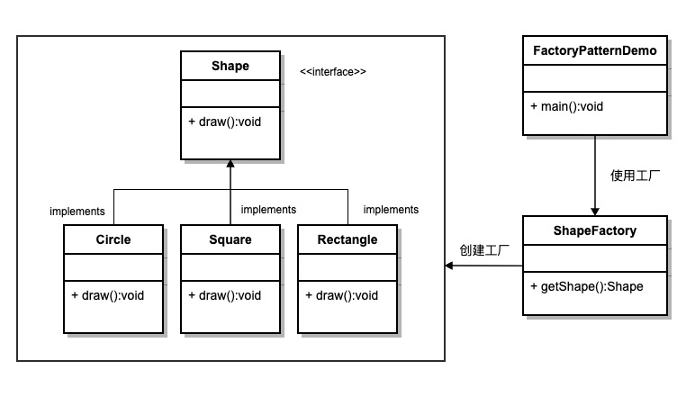
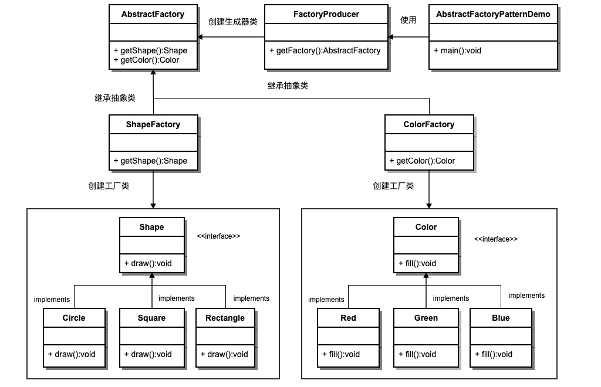
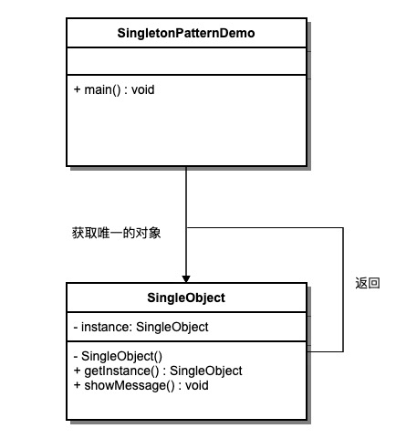
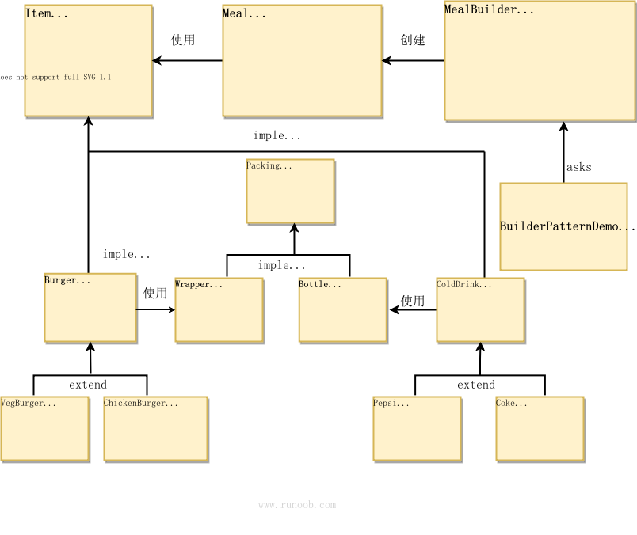

# 设计模式

---

## 一、设计模式简介

---

设计模式（Design pattern）代表了最佳的实践，通常被有经验的面向对象的软件开发人员所采用。设计模式是软件开发人员在软件开发过程中面临的一般问题的解决方案。这些解决方案是众多软件开发人员经过相当长的一段时间的试验和错误总结出来的。

设计模式是一套被反复使用的、多数人知晓的、经过分类编目的、代码设计经验的总结。使用设计模式是为了重用代码、让代码更容易被他人理解、保证代码可靠性。 毫无疑问，设计模式于己于他人于系统都是多赢的，设计模式使代码编制真正工程化，设计模式是软件工程的基石，如同大厦的一块块砖石一样。项目中合理地运用设计模式可以完美地解决很多问题，每种模式在现实中都有相应的原理来与之对应，每种模式都描述了一个在我们周围不断重复发生的问题，以及该问题的核心解决方案，这也是设计模式能被广泛应用的原因。


## 二、什么是 GOF（四人帮，全拼 Gang of Four）？

---

在 1994 年，由 Erich Gamma、Richard Helm、Ralph Johnson 和 John Vlissides 四人合著出版了一本名为 **Design Patterns - Elements of Reusable Object-Oriented Software（中文译名：设计模式 - 可复用的面向对象软件元素）** 的书，该书首次提到了软件开发中设计模式的概念。

四位作者合称 **GOF（四人帮，全拼 Gang of Four）**。他们所提出的设计模式主要是基于以下的面向对象设计原则。

- 对接口编程而不是对实现编程。
- 优先使用对象组合而不是继承。


## 三、设计模式的使用

---

设计模式在软件开发中的两个主要用途。

### 开发人员的共同平台

设计模式提供了一个标准的术语系统，且具体到特定的情景。例如，单例设计模式意味着使用单个对象，这样所有熟悉单例设计模式的开发人员都能使用单个对象，并且可以通过这种方式告诉对方，程序使用的是单例模式。

### 最佳的实践

设计模式已经经历了很长一段时间的发展，它们提供了软件开发过程中面临的一般问题的最佳解决方案。学习这些模式有助于经验不足的开发人员通过一种简单快捷的方式来学习软件设计。


## 四、设计模式的类型

---

根据设计模式的参考书 **Design Patterns - Elements of Reusable Object-Oriented Software（中文译名：设计模式 - 可复用的面向对象软件元素）** 中所提到的，总共有 23 种设计模式。这些模式可以分为三大类：创建型模式（Creational Patterns）、结构型模式（Structural Patterns）、行为型模式（Behavioral Patterns）。当然，我们还会讨论另一类设计模式：J2EE 设计模式。

| 序号 | 模式 & 描述                                                  | 包括                                                         |
| :--- | :----------------------------------------------------------- | :----------------------------------------------------------- |
| 1    | **创建型模式** 这些设计模式提供了一种在创建对象的同时隐藏创建逻辑的方式，而不是使用 new 运算符直接实例化对象。这使得程序在判断针对某个给定实例需要创建哪些对象时更加灵活。 | 工厂模式（Factory Pattern）<br>抽象工厂模式（Abstract Factory Pattern）<br>单例模式（Singleton Pattern）<br>建造者模式（Builder Pattern）<br>原型模式（Prototype Pattern） |
| 2    | **结构型模式** 这些模式关注对象之间的组合和关系，旨在解决如何构建灵活且可复用的类和对象结构。 | 适配器模式（Adapter Pattern）<br>桥接模式（Bridge Pattern）<br>过滤器模式（Filter、Criteria Pattern）<br>组合模式（Composite Pattern）<br>装饰器模式（Decorator Pattern）<br>外观模式（Facade Pattern）<br>享元模式（Flyweight Pattern）<br>代理模式（Proxy Pattern） |
| 3    | **行为型模式** 这些模式关注对象之间的通信和交互，旨在解决对象之间的责任分配和算法的封装。 | 责任链模式（Chain of Responsibility Pattern）<br>命令模式（Command Pattern）<br>解释器模式（Interpreter Pattern）<br>迭代器模式（Iterator Pattern）<br>中介者模式（Mediator Pattern）<br>备忘录模式（Memento Pattern）<br>观察者模式（Observer Pattern）<br>状态模式（State Pattern）<br>空对象模式（Null Object Pattern）<br>策略模式（Strategy Pattern）<br>模板模式（Template Pattern）<br>访问者模式（Visitor Pattern） |
| 4    | **J2EE 模式** 这些设计模式特别关注表示层。这些模式是由 Sun Java Center 鉴定的。 | MVC 模式（MVC Pattern）<br>业务代表模式（Business Delegate Pattern）<br>组合实体模式（Composite Entity Pattern）<br>数据访问对象模式（Data Access Object Pattern）<br>前端控制器模式（Front Controller Pattern）<br>拦截过滤器模式（Intercepting Filter Pattern）<br>服务定位器模式（Service Locator Pattern）<br>传输对象模式（Transfer Object Pattern） |

下面用一个图片来整体描述一下设计模式之间的关系：


## 五、设计模式的优点

---

- 提供了一种共享的设计词汇和概念，使开发人员能够更好地沟通和理解彼此的设计意图。
- 提供了经过验证的解决方案，可以提高软件的可维护性、可复用性和灵活性。
- 促进了代码的重用，避免了重复的设计和实现。
- 通过遵循设计模式，可以减少系统中的错误和问题，提高代码质量。


## 六、设计模式的六大原则

---

**1、开闭原则（Open Close Principle）**

开闭原则的意思是：**对扩展开放，对修改关闭**。在程序需要进行拓展的时候，不能去修改原有的代码，实现一个热插拔的效果。简言之，是为了使程序的扩展性好，易于维护和升级。想要达到这样的效果，我们需要使用接口和抽象类，后面的具体设计中我们会提到这点。

**2、里氏代换原则（Liskov Substitution Principle）**

里氏代换原则是面向对象设计的基本原则之一。 里氏代换原则中说，任何基类可以出现的地方，子类一定可以出现。LSP 是继承复用的基石，只有当派生类可以替换掉基类，且软件单位的功能不受到影响时，基类才能真正被复用，而派生类也能够在基类的基础上增加新的行为。里氏代换原则是对开闭原则的补充。实现开闭原则的关键步骤就是抽象化，而基类与子类的继承关系就是抽象化的具体实现，所以里氏代换原则是对实现抽象化的具体步骤的规范。

**3、依赖倒转原则（Dependence Inversion Principle）**

这个原则是开闭原则的基础，具体内容：针对接口编程，依赖于抽象而不依赖于具体。

**4、接口隔离原则（Interface Segregation Principle）**

这个原则的意思是：使用多个隔离的接口，比使用单个接口要好。它还有另外一个意思是：降低类之间的耦合度。由此可见，其实设计模式就是从大型软件架构出发、便于升级和维护的软件设计思想，它强调降低依赖，降低耦合。

**5、迪米特法则，又称最少知道原则（Demeter Principle）**

最少知道原则是指：一个实体应当尽量少地与其他实体之间发生相互作用，使得系统功能模块相对独立。

**6、合成复用原则（Composite Reuse Principle）**

合成复用原则是指：尽量使用合成/聚合的方式，而不是使用继承。


## 七、工厂模式

---

工厂模式（Factory）是Java中最常用的设计模式之一，它提供了一种创建对象对的方式，使得创建对象的过程与使用对象的过程分离。


工厂模式提供了一种创建对象的方式，而无需指定要创建的具体类。

通过使用工厂模式，可以将对象的创建逻辑封装在一个工厂类中，而不是在客户端代码中直接实例化对象，这样可以提高代码的可维护性和可拓展性。


工厂模式的类型

1. 简单工厂模式（Simple Factory Pattern）：

   简单工厂模式不是一个正常的设计模式，但它是工厂模式的基础。它使用一个单独的工厂类来创建不同的对象，根据传入的参数决定创建哪种类型的对象。

2. 工厂方法模式（Factory Method Pattern）：

   工厂方法模式定义了一个创建对象的写接口，但由子类决定实例化哪个类。工厂方法将对象的创建延迟到子类。

3. 抽象工厂模式（Abstract Factory Pattern）：

   抽象工厂模式提供一个创建一系列相关或互相依赖对象的接口，而无需指定它们具体的类。


### 概要

#### 意图

定义一个创建对象的接口，让其子类决定实例化哪一个具体的类。工厂模式使对象的创建过程延迟到子类。

#### 主要解决

接口选择的问题。

#### 何时使用

当我们需要在不同条件下创建不同实例时。

#### 如何解决

通过让子类实现工厂接口，返回一个抽象的产品。

#### 关键代码

对象的创建过程在子类中实现。

#### 应用实例

1. **汽车制造**：你需要一辆汽车，只需从工厂提货，而不需要关心汽车的制造过程及其内部实现。
2. **Hibernate**：更换数据库时，只需更改方言（Dialect）和数据库驱动（Driver），即可实现对不同数据库的切换。

#### 优点

1. 调用者只需要知道对象的名称即可创建对象。
2. 扩展性高，如果需要增加新产品，只需扩展一个工厂类即可。
3. 屏蔽了产品的具体实现，调用者只关心产品的接口。

#### 缺点

每次增加一个产品时，都需要增加一个具体类和对应的工厂，使系统中类的数量成倍增加，增加了系统的复杂度和具体类的依赖。

#### 使用场景

1. **日志记录**：日志可能记录到本地硬盘、系统事件、远程服务器等，用户可以选择记录日志的位置。
2. **数据库访问**：当用户不知道最终系统使用哪种数据库，或者数据库可能变化时。
3. **连接服务器的框架设计**：需要支持 "POP3"、"IMAP"、"HTTP" 三种协议，可以将这三种协议作为产品类，共同实现一个接口。

#### 注意事项

工厂模式适用于生成复杂对象的场景。如果对象较为简单，通过 new 即可完成创建，则不必使用工厂模式。使用工厂模式会引入一个工厂类，增加系统复杂度。

#### 结构

工厂模式包含以下几个主要角色：

- 抽象产品（Abstract Product）：定义了产品的共同接口或抽象类。它可以是具体产品类的父类或接口，规定了产品对象的共同方法。
- 具体产品（Concrete Product）：实现了抽象产品接口，定义了具体产品的特定行为和属性。
- 抽象工厂（Abstract Factory）：声明了创建产品的抽象方法，可以是接口或抽象类。它可以有多个方法用于创建不同类型的产品。
- 具体工厂（Concrete Factory）：实现了抽象工厂接口，负责实际创建具体产品的对象。

### 实现

我们将创建一个 *Shape* 接口和实现 *Shape* 接口的实体类。下一步是定义工厂类 *ShapeFactory*。

*FactoryPatternDemo* 类使用 *ShapeFactory* 来获取 *Shape* 对象。它将向 *ShapeFactory* 传递信息（*CIRCLE / RECTANGLE / SQUARE*），以便获取它所需对象的类型。



#### 步骤 1

创建一个接口:

```java
// Shape.java
public interface Shape {
   void draw();
}
```


#### 步骤 2

创建实现接口的实体类。

```java
// Rectangle.java
public class Rectangle implements Shape {
 
   @Override
   public void draw() {
      System.out.println("Inside Rectangle::draw() method.");
   }
}
```

```java
// Square.java
public class Square implements Shape {
 
   @Override
   public void draw() {
      System.out.println("Inside Square::draw() method.");
   }
}
```

```java
// Circle.java
public class Circle implements Shape {
 
   @Override
   public void draw() {
      System.out.println("Inside Circle::draw() method.");
   }
}
```


#### 步骤 3

创建一个工厂，生成基于给定信息的实体类的对象。

```java
//ShapeFactory.java
public class ShapeFactory {
    
   //使用 getShape 方法获取形状类型的对象
   public Shape getShape(String shapeType){
      if(shapeType == null){
         return null;
      }        
      if(shapeType.equalsIgnoreCase("CIRCLE")){
         return new Circle();
      } else if(shapeType.equalsIgnoreCase("RECTANGLE")){
         return new Rectangle();
      } else if(shapeType.equalsIgnoreCase("SQUARE")){
         return new Square();
      }
      return null;
   }
}
```


#### 步骤 4

使用该工厂，通过传递类型信息来获取实体类的对象。

```java
// FactoryPatternDemo.java
public class FactoryPatternDemo {
 
   public static void main(String[] args) {
      ShapeFactory shapeFactory = new ShapeFactory();
 
      //获取 Circle 的对象，并调用它的 draw 方法
      Shape shape1 = shapeFactory.getShape("CIRCLE");
 
      //调用 Circle 的 draw 方法
      shape1.draw();
 
      //获取 Rectangle 的对象，并调用它的 draw 方法
      Shape shape2 = shapeFactory.getShape("RECTANGLE");
 
      //调用 Rectangle 的 draw 方法
      shape2.draw();
 
      //获取 Square 的对象，并调用它的 draw 方法
      Shape shape3 = shapeFactory.getShape("SQUARE");
 
      //调用 Square 的 draw 方法
      shape3.draw();
   }
}
```

#### 步骤 5

执行程序，输出结果：

```java
Inside Circle::draw() method.
Inside Rectangle::draw() method.
Inside Square::draw() method.
```


## 八、抽象工厂模式

---

抽象工厂模式（Abstract Factory Pattern）是围绕一个超级工厂创建其他工厂。该超级工厂又称为其他工厂的工厂。这种类型的设计模式属于创建型模式，它提供了一种创建对象的最佳方式。


在抽象工厂模式中，接口是负责创建一个相关对象的工厂，不需要显式指定它们的类。每个生成的工厂都能按照工厂模式提供对象。

抽象工厂模式提供了一种创建一系列相关或相互依赖对象的接口，而无需指定具体实现类。通过使用抽象工厂模式，可以将客户端与具体产品的创建过程解耦，使得客户端可以通过工厂接口来创建一族产品。

### 概要

#### 意图

提供一个创建一系列相关或相互依赖对象的接口，而无需指定它们的具体类。

#### 主要解决

接口选择的问题。

#### 适用场景

当系统需要创建多个相关或依赖的对象，而不需要指定具体类时。

#### 解决方案

在一个产品族中定义多个产品，由具体工厂实现创建这些产品的方法。

#### 关键代码

在一个工厂中聚合多个同类产品的创建方法。

#### 应用实例

假设有不同类型的衣柜，每个衣柜（具体工厂）只能存放一类衣服（成套的具体产品），如商务装、时尚装等。每套衣服包括具体的上衣和裤子（具体产品）。所有衣柜都是衣柜类（抽象工厂）的具体实现，所有上衣和裤子分别实现上衣接口和裤子接口（抽象产品）。

#### 优点

1. 确保同一产品族的对象一起工作。
2. 客户端不需要知道每个对象的具体类，简化了代码。

#### 缺点

扩展产品族非常困难。增加一个新的产品族需要修改抽象工厂和所有具体工厂的代码。

#### 使用场景

1. QQ 换皮肤时，整套皮肤一起更换。
2. 创建跨平台应用时，生成不同操作系统的程序。

#### 注意事项

增加新的产品族相对容易，而增加新的产品等级结构比较困难。

#### 结构

抽象工厂模式包含以下几个主要角色：

- 抽象工厂（Abstract Factory）：声明了一组用于创建产品对象的方法，每个方法对应一种产品类型。抽象工厂可以是接口或抽象类。
- 具体工厂（Concrete Factory）：实现了抽象工厂接口，负责创建具体产品对象的实例。
- 抽象产品（Abstract Product）：定义了一组产品对象的共同接口或抽象类，描述了产品对象的公共方法。
- 具体产品（Concrete Product）：实现了抽象产品接口，定义了具体产品的特定行为和属性。

抽象工厂模式通常涉及一族相关的产品，每个具体工厂类负责创建该族中的具体产品。客户端通过使用抽象工厂接口来创建产品对象，而不需要直接使用具体产品的实现类。

### 实现

我们将创建 *Shape* 和 *Color* 接口和实现这些接口的实体类。下一步是创建抽象工厂类 *AbstractFactory*。接着定义工厂类 *ShapeFactory* 和 *ColorFactory*，这两个工厂类都是扩展了 *AbstractFactory*。然后创建一个工厂创造器/生成器类 *FactoryProducer*。

*AbstractFactoryPatternDemo* 类使用 *FactoryProducer* 来获取 *AbstractFactory* 对象。它将向 *AbstractFactory* 传递形状信息 *Shape*（*CIRCLE / RECTANGLE / SQUARE*），以便获取它所需对象的类型。同时它还向 *AbstractFactory* 传递颜色信息 *Color*（*RED / GREEN / BLUE*），以便获取它所需对象的类型。



#### 步骤 1

为形状创建一个接口。

```java
// Shape.java
public interface Shape{
    void draw();
}
```

#### 步骤 2

创建实现接口的实体类。

```java
// Rectangle.java
public class Rectangle implements Shape {
 
   @Override
   public void draw() {
      System.out.println("Inside Rectangle::draw() method.");
   }
}
```

```java
// Square.java
public class Square implements Shape {
 
   @Override
   public void draw() {
      System.out.println("Inside Square::draw() method.");
   }
}
```

```java
// Circle.java
public class Circle implements Shape {
     @Override
    public void draw() {
        System.out.println("Inside Circle::draw() method.")
    }
}
```

#### 步骤 3

为颜色创建一个接口。

```java
// Color.java
public interface Color {
    void fill();
}
```

#### 步骤4

创建实现接口的实体类。

```java
// Red.java
public class Red implements Color {
 
   @Override
   public void fill() {
      System.out.println("Inside Red::fill() method.");
   }
}
```

```java
// Green.java
public class Green implements Color {
 
   @Override
   public void fill() {
      System.out.println("Inside Green::fill() method.");
   }
}
```

```java
// Blue.java
public class Blue implements Color {
 
   @Override
   public void fill() {
      System.out.println("Inside Blue::fill() method.");
   }
}
```

#### 步骤 5

为 Color 和 Shape 对象创建抽象类来获取工厂。

```java
// AbstractFactory.java
public abstract class AbstractFactory {
   public abstract Color getColor(String color);
   public abstract Shape getShape(String shape);
}
```

#### 步骤 6

创建扩展了 AbstractFactory 的工厂类，基于给定的信息生成实体类的对象。

```java
// ShapeFactory.java
public class ShapeFactory extends AbstractFactory {
    
   @Override
   public Shape getShape(String shapeType){
      if(shapeType == null){
         return null;
      }        
      if(shapeType.equalsIgnoreCase("CIRCLE")){
         return new Circle();
      } else if(shapeType.equalsIgnoreCase("RECTANGLE")){
         return new Rectangle();
      } else if(shapeType.equalsIgnoreCase("SQUARE")){
         return new Square();
      }
      return null;
   }
   
   @Override
   public Color getColor(String color) {
      return null;
   }
}
```

```java
// ColorFactory.java
public class ColorFactory extends AbstractFactory {
    
   @Override
   public Shape getShape(String shapeType){
      return null;
   }
   
   @Override
   public Color getColor(String color) {
      if(color == null){
         return null;
      }        
      if(color.equalsIgnoreCase("RED")){
         return new Red();
      } else if(color.equalsIgnoreCase("GREEN")){
         return new Green();
      } else if(color.equalsIgnoreCase("BLUE")){
         return new Blue();
      }
      return null;
   }
}
```

#### 步骤 7

创建一个工厂创造器/生成器类，通过传递形状或颜色信息来获取工厂。

```java
// FactoryProducer.java
public class FactoryProducer {
   public static AbstractFactory getFactory(String choice){
      if(choice.equalsIgnoreCase("SHAPE")){
         return new ShapeFactory();
      } else if(choice.equalsIgnoreCase("COLOR")){
         return new ColorFactory();
      }
      return null;
   }
}
```

#### 步骤 8

使用 FactoryProducer 来获取 AbstractFactory，通过传递类型信息来获取实体类的对象。

```java
// AbstractFactoryPatternDemo.java
public class AbstractFactoryPatternDemo {
   public static void main(String[] args) {
 
      //获取形状工厂
      AbstractFactory shapeFactory = FactoryProducer.getFactory("SHAPE");
 
      //获取形状为 Circle 的对象
      Shape shape1 = shapeFactory.getShape("CIRCLE");
 
      //调用 Circle 的 draw 方法
      shape1.draw();
 
      //获取形状为 Rectangle 的对象
      Shape shape2 = shapeFactory.getShape("RECTANGLE");
 
      //调用 Rectangle 的 draw 方法
      shape2.draw();
      
      //获取形状为 Square 的对象
      Shape shape3 = shapeFactory.getShape("SQUARE");
 
      //调用 Square 的 draw 方法
      shape3.draw();
 
      //获取颜色工厂
      AbstractFactory colorFactory = FactoryProducer.getFactory("COLOR");
 
      //获取颜色为 Red 的对象
      Color color1 = colorFactory.getColor("RED");
 
      //调用 Red 的 fill 方法
      color1.fill();
 
      //获取颜色为 Green 的对象
      Color color2 = colorFactory.getColor("GREEN");
 
      //调用 Green 的 fill 方法
      color2.fill();
 
      //获取颜色为 Blue 的对象
      Color color3 = colorFactory.getColor("BLUE");
 
      //调用 Blue 的 fill 方法
      color3.fill();
   }
}
```

#### 步骤 9

执行程序，输出结果：

```shell
Inside Circle::draw() method.
Inside Rectangle::draw() method.
Inside Square::draw() method.
Inside Red::fill() method.
Inside Green::fill() method.
Inside Blue::fill() method.
```


## 九、单例模式

单例模式（Singleton Pattern）是 Java 中最简单的设计模式之一。这种类型的设计模式属于创建型模式，它提供了一种创建对象的最佳方式。

这种模式涉及到一个单一的类，该类负责创建自己的对象，同时确保只有单个对象被创建。这个类提供了一种访问其唯一的对象的方式，可以直接访问，不需要实例化该类的对象。

单例模式是一种创建型设计模式，它确保一个类只有一个实例，并提供了一个全局访问点来访问该实例。

**注意：**

- 1、单例类只能有一个实例。
- 2、单例类必须自己创建自己的唯一实例。
- 3、单例类必须给所有其他对象提供这一实例。


### 概要

#### 单例模式（Singleton Pattern）

#### 意图

确保一个类只有一个实例，并提供一个全局访问点来访问该实例。

#### 主要解决

频繁创建和销毁全局使用的类实例的问题。

#### 何时使用

当需要控制实例数目，节省系统资源时。

#### 如何解决

检查系统是否已经存在该单例，如果存在则返回该实例；如果不存在则创建一个新实例。

#### 关键代码

构造函数是私有的。

#### 应用实例

- 一个班级只有一个班主任。
- Windows 在多进程多线程环境下操作文件时，避免多个进程或线程同时操作一个文件，需要通过唯一实例进行处理。
- 设备管理器设计为单例模式，例如电脑有两台打印机，避免同时打印同一个文件。

#### 优点

- 内存中只有一个实例，减少内存开销，尤其是频繁创建和销毁实例时（如管理学院首页页面缓存）。
- 避免资源的多重占用（如写文件操作）。

#### 缺点

- 没有接口，不能继承。
- 与单一职责原则冲突，一个类应该只关心内部逻辑，而不关心实例化方式。

#### 使用场景

- 生成唯一序列号。
- WEB 中的计数器，避免每次刷新都在数据库中增加计数，先缓存起来。
- 创建消耗资源过多的对象，如 I/O 与数据库连接等。

#### 注意事项

- **线程安全**：`getInstance()` 方法中需要使用同步锁 `synchronized (Singleton.class)` 防止多线程同时进入造成实例被多次创建。
- **延迟初始化**：实例在第一次调用 `getInstance()` 方法时创建。
- **序列化和反序列化**：重写 `readResolve` 方法以确保反序列化时不会创建新的实例。
- **反射攻击**：在构造函数中添加防护代码，防止通过反射创建新实例。
- **类加载器问题**：注意复杂类加载环境可能导致的多个实例问题。

#### 结构

单例模式包含以下几个主要角色：

- 单例类：包含单例实例的类，通常将构造函数声明为私有。
- 静态成员变量：用于存储单例实例的静态成员变量。
- 获取实例方法：静态方法，用于获取单例实例。
- 私有构造函数：防止外部直接实例化单例类。
- 线程安全处理：确保在多线程环境下单例实例的创建是安全的。

### 实现

我们将创建一个 *SingleObject* 类。*SingleObject* 类有它的私有构造函数和本身的一个静态实例。

*SingleObject* 类提供了一个静态方法，供外界获取它的静态实例。*SingletonPatternDemo* 类使用 *SingleObject* 类来获取 *SingleObject* 对象。



#### 步骤 1

创建一个 Singleton 类。

```java
// SingleObject.java
public class SingleObject {
 
   //创建 SingleObject 的一个对象
   private static SingleObject instance = new SingleObject();
 
   //让构造函数为 private，这样该类就不会被实例化
   private SingleObject(){}
 
   //获取唯一可用的对象
   public static SingleObject getInstance(){
      return instance;
   }
 
   public void showMessage(){
      System.out.println("Hello World!");
   }
}
```

#### 步骤 2

从 singleton 类获取唯一的对象。

```java
// SingletonPatternDemo.java
public class SingletonPatternDemo {
   public static void main(String[] args) {
 
      //不合法的构造函数
      //编译时错误：构造函数 SingleObject() 是不可见的
      //SingleObject object = new SingleObject();
 
      //获取唯一可用的对象
      SingleObject object = SingleObject.getInstance();
 
      //显示消息
      object.showMessage();
   }
}
```

### 步骤 3

执行程序，输出结果：

```
Hello World!
```

### 单例模式的几种实现方式

单例模式的实现有多种方式，如下所示：

#### 1、懒汉式，线程不安全

**是否 Lazy 初始化：**是

**是否多线程安全：**否

**实现难度：**易

**描述：**这种方式是最基本的实现方式，这种实现最大的问题就是不支持多线程。因为没有加锁 synchronized，所以严格意义上它并不算单例模式。
这种方式 lazy loading 很明显，不要求线程安全，在多线程不能正常工作。

```java
public class Singleton {  
    private static Singleton instance;  
    private Singleton (){}  
  
    public static Singleton getInstance() {  
        if (instance == null) {  
            instance = new Singleton();  
        }  
        return instance;  
    }  
}
```

**接下来介绍的几种实现方式都支持多线程，但是在性能上有所差异。**


#### 2、懒汉式，线程安全

**是否 Lazy 初始化：**是

**是否多线程安全：**是

**实现难度：**易

**描述：**这种方式具备很好的 lazy loading，能够在多线程中很好的工作，但是，效率很低，99% 情况下不需要同步。
优点：第一次调用才初始化，避免内存浪费。
缺点：必须加锁 synchronized 才能保证单例，但加锁会影响效率。
getInstance() 的性能对应用程序不是很关键（该方法使用不太频繁）。

```java
public class Singleton {  
    private static Singleton instance;  
    private Singleton (){}  
    public static synchronized Singleton getInstance() {  
        if (instance == null) {  
            instance = new Singleton();  
        }  
        return instance;  
    }  
}
```


#### 3、饿汉式

**是否 Lazy 初始化：**否

**是否多线程安全：**是

**实现难度：**易

**描述：**这种方式比较常用，但容易产生垃圾对象。
优点：没有加锁，执行效率会提高。
缺点：类加载时就初始化，浪费内存。
它基于 classloader 机制避免了多线程的同步问题，不过，instance 在类装载时就实例化，虽然导致类装载的原因有很多种，在单例模式中大多数都是调用 getInstance 方法， 但是也不能确定有其他的方式（或者其他的静态方法）导致类装载，这时候初始化 instance 显然没有达到 lazy loading 的效果。

```java
public class Singleton {  
    private static Singleton instance = new Singleton();  
    private Singleton (){}  
    public static Singleton getInstance() {  
    return instance;  
    }  
}
```

#### 4、双检锁/双重校验锁（DCL，即 double-checked locking）

**JDK 版本：**JDK1.5 起

**是否 Lazy 初始化：**是

**是否多线程安全：**是

**实现难度：**较复杂

**描述：**这种方式采用双锁机制，安全且在多线程情况下能保持高性能。
getInstance() 的性能对应用程序很关键。

```java
public class Singleton {  
    private volatile static Singleton singleton;  
    private Singleton (){}  
    public static Singleton getSingleton() {  
    if (singleton == null) {  
        synchronized (Singleton.class) {  
            if (singleton == null) {  
                singleton = new Singleton();  
            }  
        }  
    }  
    return singleton;  
    }  
}
```

#### 5、登记式/静态内部类

**是否 Lazy 初始化：**是

**是否多线程安全：**是

**实现难度：**一般

**描述：**这种方式能达到双检锁方式一样的功效，但实现更简单。对静态域使用延迟初始化，应使用这种方式而不是双检锁方式。这种方式只适用于静态域的情况，双检锁方式可在实例域需要延迟初始化时使用。
这种方式同样利用了 classloader 机制来保证初始化 instance 时只有一个线程，它跟第 3 种方式不同的是：第 3 种方式只要 Singleton 类被装载了，那么 instance 就会被实例化（没有达到 lazy loading 效果），而这种方式是 Singleton 类被装载了，instance 不一定被初始化。因为 SingletonHolder 类没有被主动使用，只有通过显式调用 getInstance 方法时，才会显式装载 SingletonHolder 类，从而实例化 instance。想象一下，如果实例化 instance 很消耗资源，所以想让它延迟加载，另外一方面，又不希望在 Singleton 类加载时就实例化，因为不能确保 Singleton 类还可能在其他的地方被主动使用从而被加载，那么这个时候实例化 instance 显然是不合适的。这个时候，这种方式相比第 3 种方式就显得很合理。

```java
public class Singleton {  
    private static class SingletonHolder {  
    private static final Singleton INSTANCE = new Singleton();  
    }  
    private Singleton (){}  
    public static final Singleton getInstance() {  
        return SingletonHolder.INSTANCE;  
    }  
}
```

#### 6、枚举

**JDK 版本：**JDK1.5 起

**是否 Lazy 初始化：**否

**是否多线程安全：**是

**实现难度：**易

**描述：**这种实现方式还没有被广泛采用，但这是实现单例模式的最佳方法。它更简洁，自动支持序列化机制，绝对防止多次实例化。
这种方式是 Effective Java 作者 Josh Bloch 提倡的方式，它不仅能避免多线程同步问题，而且还自动支持序列化机制，防止反序列化重新创建新的对象，绝对防止多次实例化。不过，由于 JDK1.5 之后才加入 enum 特性，用这种方式写不免让人感觉生疏，在实际工作中，也很少用。
不能通过 reflection attack 来调用私有构造方法。

```java
public enum Singleton {  
    INSTANCE;  
    public void whateverMethod() {  
    }  
}
```

**经验之谈：**一般情况下，不建议使用第 1 种和第 2 种懒汉方式，建议使用第 3 种饿汉方式。只有在要明确实现 lazy loading 效果时，才会使用第 5 种登记方式。如果涉及到反序列化创建对象时，可以尝试使用第 6 种枚举方式。如果有其他特殊的需求，可以考虑使用第 4 种双检锁方式。


## 十、建造者模式

建造者模式是一种创建型设计模式，它允许你创建复杂对象的步骤与表示方式相分离。

建造者模式是一种创建型设计模式，它的主要目的是将一个复杂对象的构建过程与其表示相分离，从而可以创建具有不同表示形式的对象。

### 概要

#### 意图

将一个复杂的构建过程与其表示相分离，使得同样的构建过程可以创建不同的表示。

#### 主要解决

在软件系统中，一个复杂对象的创建通常由多个部分组成，这些部分的组合经常变化，但组合的算法相对稳定。

#### 何时使用

当一些基本部件不变，而其组合经常变化时。

#### 如何解决

将变与不变的部分分离开。

#### 关键代码

- **建造者**：创建并提供实例。
- **导演**：管理建造出来的实例的依赖关系和控制构建过程。

#### 应用实例

- 去肯德基，汉堡、可乐、薯条、炸鸡翅等是不变的，而其组合是经常变化的，生成出不同的"套餐"。
- Java 中的 `StringBuilder`。

#### 优点

- 分离构建过程和表示，使得构建过程更加灵活，可以构建不同的表示。
- 可以更好地控制构建过程，隐藏具体构建细节。
- 代码复用性高，可以在不同的构建过程中重复使用相同的建造者。

#### 缺点

- 如果产品的属性较少，建造者模式可能会导致代码冗余。
- 增加了系统的类和对象数量。

#### 使用场景

- 需要生成的对象具有复杂的内部结构。
- 需要生成的对象内部属性相互依赖。

#### 注意事项

与工厂模式的区别是：建造者模式更加关注于零件装配的顺序。

#### 结构

建造者模式包含以下几个主要角色：

- **产品（Product）**：要构建的复杂对象。产品类通常包含多个部分或属性。
- **抽象建造者（Builder）**：定义了构建产品的抽象接口，包括构建产品的各个部分的方法。
- **具体建造者（Concrete Builder）**：实现抽象建造者接口，具体确定如何构建产品的各个部分，并负责返回最终构建的产品。
- **指导者（Director）**：负责调用建造者的方法来构建产品，指导者并不了解具体的构建过程，只关心产品的构建顺序和方式。

### 实现

我们假设一个快餐店的商业案例，其中，一个典型的套餐可以是一个汉堡（Burger）和一杯冷饮（Cold drink）。汉堡（Burger）可以是素食汉堡（Veg Burger）或鸡肉汉堡（Chicken Burger），它们是包在纸盒中。冷饮（Cold drink）可以是可口可乐（coke）或百事可乐（pepsi），它们是装在瓶子中。

我们将创建一个表示食物条目（比如汉堡和冷饮）的 *Item* 接口和实现 *Item* 接口的实体类，以及一个表示食物包装的 *Packing* 接口和实现 *Packing* 接口的实体类，汉堡是包在纸盒中，冷饮是装在瓶子中。

然后我们创建一个 *Meal* 类，带有 *Item* 的 *ArrayList* 和一个通过结合 *Item* 来创建不同类型的 *Meal* 对象的 *MealBuilder*。*BuilderPatternDemo* 类使用 *MealBuilder* 来创建一个 *Meal*。



#### 步骤 1

创建一个表示食物条目和食物包装的接口。

```java
// Item.java
public interface Item {
   public String name();
   public Packing packing();
   public float price();    
}
```

```java
// Packing.java
public interface Packing {
   public String pack();
}
```


#### 步骤 2

创建实现 Packing 接口的实体类。

```java
// Wrapper.java
public class Wrapper implements Packing {
 
   @Override
   public String pack() {
      return "Wrapper";
   }
}
```

```java
// Bottle.java
public class Bottle implements Packing {
 
   @Override
   public String pack() {
      return "Bottle";
   }
}
```


#### 步骤 3

创建实现 Item 接口的抽象类，该类提供了默认的功能。

```java
// Burger.java
public abstract class Burger implements Item {
 
   @Override
   public Packing packing() {
      return new Wrapper();
   }
 
   @Override
   public abstract float price();
}
```

```java
// ColdDrink.java
public abstract class ColdDrink implements Item {
 
    @Override
    public Packing packing() {
       return new Bottle();
    }
 
    @Override
    public abstract float price();
}
```


#### 步骤 4

创建扩展了 Burger 和 ColdDrink 的实体类。

```java
// VegBurger.java
public class VegBurger extends Burger {
 
   @Override
   public float price() {
      return 25.0f;
   }
 
   @Override
   public String name() {
      return "Veg Burger";
   }
}
```

```java
// ChickenBurger.java
public class ChickenBurger extends Burger {
 
   @Override
   public float price() {
      return 50.5f;
   }
 
   @Override
   public String name() {
      return "Chicken Burger";
   }
}
```

```java
// Coke.java
public class Coke extends ColdDrink {
 
   @Override
   public float price() {
      return 30.0f;
   }
 
   @Override
   public String name() {
      return "Coke";
   }
}
```

```java
// Pepsi.java
public class Pepsi extends ColdDrink {
 
   @Override
   public float price() {
      return 35.0f;
   }
 
   @Override
   public String name() {
      return "Pepsi";
   }
}
```


#### 步骤 5

创建一个 Meal 类，带有上面定义的 Item 对象。

```java
// Meal.java
import java.util.ArrayList;
import java.util.List;
 
public class Meal {
   private List<Item> items = new ArrayList<Item>();    
 
   public void addItem(Item item){
      items.add(item);
   }
 
   public float getCost(){
      float cost = 0.0f;
      for (Item item : items) {
         cost += item.price();
      }        
      return cost;
   }
 
   public void showItems(){
      for (Item item : items) {
         System.out.print("Item : "+item.name());
         System.out.print(", Packing : "+item.packing().pack());
         System.out.println(", Price : "+item.price());
      }        
   }    
}
```


#### 步骤 6

创建一个 MealBuilder 类，实际的 builder 类负责创建 Meal 对象。

```java
// MealBuilder.java
public class MealBuilder {
 
   public Meal prepareVegMeal (){
      Meal meal = new Meal();
      meal.addItem(new VegBurger());
      meal.addItem(new Coke());
      return meal;
   }   
 
   public Meal prepareNonVegMeal (){
      Meal meal = new Meal();
      meal.addItem(new ChickenBurger());
      meal.addItem(new Pepsi());
      return meal;
   }
}
```


#### 步骤 7

BuiderPatternDemo 使用 MealBuilder 来演示建造者模式（Builder Pattern）。

```java
// BuilderPatternDemo.java
public class BuilderPatternDemo {
   public static void main(String[] args) {
      MealBuilder mealBuilder = new MealBuilder();
 
      Meal vegMeal = mealBuilder.prepareVegMeal();
      System.out.println("Veg Meal");
      vegMeal.showItems();
      System.out.println("Total Cost: " +vegMeal.getCost());
 
      Meal nonVegMeal = mealBuilder.prepareNonVegMeal();
      System.out.println("\n\nNon-Veg Meal");
      nonVegMeal.showItems();
      System.out.println("Total Cost: " +nonVegMeal.getCost());
   }
}
```


#### 步骤 8

执行程序，输出结果：

```
Veg Meal
Item : Veg Burger, Packing : Wrapper, Price : 25.0
Item : Coke, Packing : Bottle, Price : 30.0
Total Cost: 55.0


Non-Veg Meal
Item : Chicken Burger, Packing : Wrapper, Price : 50.5
Item : Pepsi, Packing : Bottle, Price : 35.0
Total Cost: 85.5
```

------

### 相关文章

- [设计模式之建造者(Builder)模式](https://www.runoob.com/w3cnote/builder-pattern.html)
- [设计模式：Builder模式](https://www.runoob.com/w3cnote/builder-pattern-2.html)


## 参考文献

[设计模式 | 菜鸟教程](https://www.runoob.com/design-pattern/design-pattern-tutorial.html)