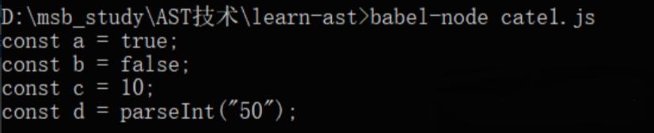
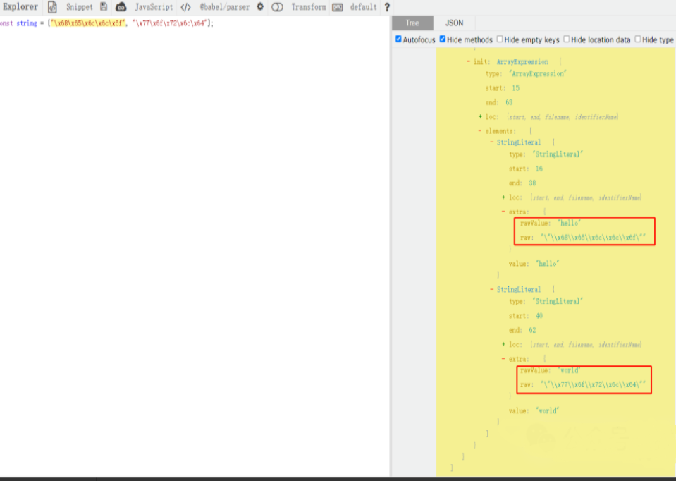
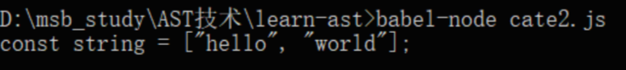

# 使用AST技术还原混淆代码

---

由于JavaScript混淆方式多种多样，这里就介绍一些常见的反混淆方案，如表达式还原，字符串还原，无用代码剔除，反控制流平坦化等。

```shell
npm install @babel/core --save-dev
npm install @babel/types
npm install @babel/parser
npm install @babel/traverse
npm install @babel/generator
```


## 1 表达式还原

有时候，我们会看到有一些混淆的JavaScript代码其实就是把简单的东西复杂化，比如说一个布尔常量true，被写成 !![] ; 一个数字，被转化为parseInt加一些字符串的拼接。通过这些方式，一些简单又直观的表达式就被复杂化了。

看下面的这几个例子，代码如下：code2.js

```javascript
const a = !![];
const b = "abc" == "bcd";
const c = (1 << 3) | 2;
const d = parseInt("5" + "0");
```

对于这种情况，有没有还原的方法呢？当然有，借助于AST，我们可以轻松实现。

首先，在=的右侧，其实都是一些表达式的类型，比如 “abc” = “bcd” 就是一个BinaryExpression，他代表的是一个布尔类型的结果。

怎么处理呢？我们将上述代码保存为code2.js，根据上一章节学到的知识，可以编写如下还原代码：

```javascript
import traverse from "@babel/traverse";
import { parse } from "@babel/parser";
import generate from "@babel/generator";
import * as types from "@babel/types";
import fs from "fs";
const code = fs.readFileSync("codes/code2.js", "utf-8");
let ast = parse(code);
traverse(ast, {  "UnaryExpression|BinaryExpression|ConditionalExpression|CallExpression": (    path  ) => {    const { confident, value } = path.evaluate();    if (value == Infinity || value == -Infinity) return;    confident && path.replaceWith(types.valueToNode(value));  },});const { code: output } = generate(ast);
console.log(output);
```

这里我们使用traverse方法对AST对象进行遍历，，使用“`UnaryExpression|BinaryExpression|ConditionalExpression|CallExpression`“作为对象的键名，分别用于处理一元表达式、布尔表达式、条件表达式、调用表达式。如果AST对应的path对象符合这几种表达式，就会执行我们定义的回调方法。在回调方法里面，我们调用了path的evaluate方法，该方法会对path对象进行执行，计算所得到的结果。其内部实现会返回一个confident的value字段表示置信度，如果认定结果是可信的，那么confident就是true，我们可以调用path的replaceWith方法把执行的结果value进行替换，否侧不替换。

运行结果如下：



可以看到，原本看起来不怎么直观的代码现在被还原得非常直观了。

所以，利用这个原理，我们可以实现一些表达式的还原和计算，提高整个代码的可读性。


## 2 字符串还原

之前我们了解到，JavaScript被混淆后，有些字符串会被转化为Unicode或者UTF-8编码的数据，比如说这个样子：

```javascript
const string = [“\x68\x65\x6c\x6c\x6f”, “\x77\x6f\x72\x6c\x64”];
```

其实这原本就是一个简单的字符串，被转换成UTF-8编码之后，其可读性大大降低了，如果这样的字符串被隐藏在JavaScript代码里面，我们想通过搜索字符串的方式寻找关键突破口，就搜不到了。

对于这种字符串，我们能用AST还原码？当然可以。

我们先在https://astexplorer.net/里面把这行代码粘贴进去，结果如图所示：



可以看到，两个字符串都被识别成了 `StringLiteral`类型，它们都有一个extra属性。extra属性里卖有一个raw属性和rawValue属性，二者是不一样的，rawValue的真实值已经被分析出来了。

因此，我们只需要将 StringLiteral 中 extra 属性的 raw 值替换为 rawValue 的值即可，实现如下：

```javascript
import traverse from "@babel/traverse";
import { parse } from "@babel/parser";
import generate from "@babel/generator";
import fs from "fs";

const code = fs.readFileSync("codes/code3.js", "utf-8");
let ast = parse(code);

traverse(ast, {
  StringLiteral({ node }) {
    if (node.extra && /\\[ux]/gi.test(node.extra.raw)) {
      node.extra.rawValue = node.extra.raw;
    }
  },
});

const { code: output } = generate(ast);
console.log(output);
```

输出结果如下：



这样我们就成功实现了混淆字符串的还原。

如果我们把这个脚本应用于混杂了混淆字符串的JavaScript文件，那么其中的混淆字符串就可以被还原出来。


## 常用反混淆工具

[de4js | JavaScript Deobfuscator and Unpacker](https://lelinhtinh.github.io/de4js/)

[JSDec - Liulihaocai](https://jsdec.js.org/)

[AST explorer](https://astexplorer.net/)


## 参考文献

[最全的JS逆向-一篇带你学完爬虫逆向所有知识点 - 守护式等待 - 博客园](https://www.cnblogs.com/yoyo1216/p/19022581)